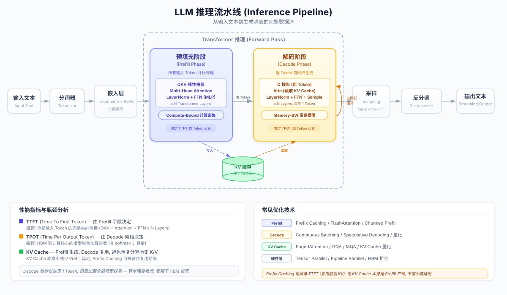

# LLM 推理全流程深度解析：从输入到输出

> 本文系统梳理大语言模型（LLM）从接收请求到返回结果的完整推理流水线，重点拆解 Prefill 与 Decode 两大核心阶段的计算特性、瓶颈本质与优化方向，并纠正业界常见的认知误区。



---

## 1. 概述：推理与训练的本质区别

LLM 推理（Inference）是指模型在训练完成后，接受用户输入并生成响应文本的过程。与训练阶段的核心差异在于：

| 维度 | Training | Inference |
|------|----------|-----------|
| **目标** | 更新模型权重（反向传播） | 利用固定权重生成文本（仅前向传播） |
| **并行度** | 大批量数据并行 | 单请求或小批量，延迟敏感 |
| **计算模式** | Compute-bound 为主 | Prefill Compute-bound + Decode Memory-bandwidth-bound |
| **权重状态** | 持续更新 | 冻结不变 |

推理流水线的核心挑战：**在延迟（Latency）与吞吐（Throughput）之间取得平衡**。用户感知到的延迟由两个指标决定——TTFT（Time To First Token，首 token 延迟）和 TPOT（Time Per Output Token，逐 token 生成速度），它们分别由 Prefill 和 Decode 阶段主导。

---

## 2. 完整流水线：八大阶段全景

一个 LLM 推理请求从进入系统到返回结果，依次经历以下八个阶段：

### 2.1 Request Reception（请求接收）

API Gateway 接收 HTTP 请求，解析参数（`temperature`、`max_tokens`、`top_p` 等），将 system prompt、user prompt、chat history 按模型要求的 chat template 组装为完整输入序列。调度器（Scheduler）决定该请求的排队与批处理策略。

### 2.2 Tokenization（分词）

将自然语言文本转换为模型可处理的 token ID 序列。

- **算法**：BPE（Byte Pair Encoding）或 SentencePiece（如 LLaMA 系列）
- **输出**：整数序列，如 `"Hello world"` → `[15496, 995]`
- **关键细节**：不同模型的 tokenizer 词表不同，同一句话的 token 数量可能差异显著

### 2.3 Embedding（嵌入映射）

Token ID 序列通过 Embedding Layer 映射为稠密向量，同时叠加位置编码信息。

- **Token Embedding**：查表操作，`token_id → R^{d_model}` 向量
- **Positional Encoding**：现代模型主流使用 RoPE（Rotary Position Embedding），在 Attention 计算时注入相对位置信息，而非直接加到 Embedding 上
- **输出维度**：`[seq_len, d_model]`，如 LLaMA-70B 的 `d_model = 8192`

### 2.4 Prefill Phase（预填充阶段） — Inference 宏阶段之一

**所有输入 token 并行通过全部 Transformer 层的完整前向传播。**

这是 Inference 宏阶段的第一个子阶段。所有输入 token 被一次性送入模型，逐层计算 Attention 和 FFN，产出两个关键结果：

1. **KV Cache**：每一层的 K、V 向量被缓存，供后续 Decode 阶段复用
2. **First token logits**：最后一个位置的输出 logits，经 Sampling 后得到第一个生成 token

**瓶颈特性：Compute-bound（计算密集型）**。详见第 3 节。

### 2.5 Decode Phase（解码阶段） — Inference 宏阶段之二

**自回归循环：每一步生成一个 token，直到遇到 EOS 或达到 `max_tokens`。**

这是 Inference 宏阶段的第二个子阶段。每个 step 仅处理一个新 token，借助 KV Cache 避免重复计算历史 token 的 K、V。

**瓶颈特性：Memory-bandwidth-bound（显存带宽瓶颈）**。详见第 4 节。

### 2.6 Sampling（采样）

将模型输出的 raw logits 转换为下一个 token 的选择：

```
logits → logits / temperature → top-k 截断 → top-p (nucleus) 截断 → softmax → 概率分布 → 采样/argmax
```

- **Temperature**：控制分布锐度。`T < 1` 更确定性，`T > 1` 更随机
- **Top-k**：只保留概率最高的 k 个候选
- **Top-p (Nucleus Sampling)**：保留累积概率达到 p 的最小 token 集合
- **Repetition Penalty**：抑制重复生成

### 2.7 De-tokenization（逆分词）

将采样得到的 token ID 映射回文本字符串。需要处理 subword 拼接、特殊 token 过滤等细节。

### 2.8 Streaming Response（流式返回）

每生成一个 token（或一小批 token），立即通过 SSE（Server-Sent Events）推送给客户端，而非等待全部生成完毕。这使得用户在 TTFT 之后即可开始阅读响应，显著改善体感延迟。

---

## 3. Prefill 深度解析

### 3.1 计算过程

Prefill 阶段将长度为 `n` 的输入序列一次性送入模型的所有 `L` 层 Transformer，**每一层的计算流程**如下：

```
Input [n, d] 
  → Linear(Q) [n, d] + Linear(K) [n, d] + Linear(V) [n, d]    // QKV 投影
  → Multi-Head Attention                                         // 注意力计算
  → Residual + LayerNorm                                         // 残差连接 + 归一化
  → FFN/MLP (两个大型线性层 + 激活函数)                            // 前馈网络
  → Residual + LayerNorm                                         // 残差连接 + 归一化
Output [n, d]
```

所有 `n` 个 token 的计算在每一层内**完全并行**执行——这是 Prefill 与 Decode 的根本区别。

### 3.2 为何是 Compute-bound

Prefill 的计算密集度（Arithmetic Intensity）极高，原因在于：

- **QKV 投影**：三次 `[n, d] × [d, d]` 矩阵乘法 → FLOPs 量级 `O(n * d^2)`
- **Attention Score**：`[n, d_head] × [d_head, n]` → FLOPs 量级 `O(n^2 * d_head)`
- **FFN/MLP**：通常包含两次 `[n, d] × [d, 4d]` 量级的 GEMM → FLOPs 量级 `O(n * d * d_ff)`
- 以上计算在 **L 层** 中重复执行

当输入序列较长（`n` 较大）时，计算量与 `n` 呈线性甚至二次关系增长，GPU 的算力（FLOPS）成为瓶颈，而非显存带宽。此时 GPU 计算单元被充分利用，Arithmetic Intensity 高。

### 3.3 KV Cache 在 Prefill 中的角色

**KV Cache 在 Prefill 阶段被"生成"，而非被"消费"。**

- Prefill 过程中，每一层的 K、V 矩阵（维度 `[n, d_head]` per head）被计算并**写入** KV Cache
- 这些缓存将在后续 Decode 阶段被读取复用
- KV Cache 本身**不会降低** Prefill 的延迟——Prefill 的全部计算量一个也不能省

### 3.4 TTFT 与 Prefill 的关系

```
TTFT ≈ Prefill 延迟 + Scheduling 开销 + 首 token Sampling 时间
```

Prefill 延迟是 TTFT 的绝对主导因素。输入越长，TTFT 越高。

### 3.5 Prefill 优化技术

| 技术                          | 原理                                                                     | 收益                                |
| --------------------------- | ---------------------------------------------------------------------- | --------------------------------- |
| **Prefix Caching**          | 跨请求复用相同前缀的 KV Cache（如 system prompt），跳过已缓存部分的 Prefill 计算               | 大幅降低 TTFT（对共享前缀场景）                |
| **FlashAttention**          | 利用 tiling 算法将 Attention 计算分块，减少 HBM 读写次数，提升 Attention 计算的实际吞吐          | 降低 Prefill wall-clock time，减少显存占用 |
| **Chunked Prefill**         | 将长序列的 Prefill 分块执行，在 chunk 间隙插入 Decode step，避免长 Prefill 阻塞其他请求的 Decode | 改善系统整体延迟公平性（tail latency）         |
| **Tensor Parallelism (TP)** | 将 GEMM 操作拆分到多张 GPU 上并行计算                                               | 近线性加速 Prefill（受 NVLink 带宽限制）      |
| **Quantization (W8A8/FP8)** | 降低权重和激活精度，提高 GEMM 吞吐                                                   | 降低 Prefill 延迟，减少显存占用              |

---

## 4. Decode 深度解析

### 4.1 计算过程

Decode 阶段以自回归（Auto-regressive）方式逐 token 生成。**每个 step** 的计算流程：

```
新 token embedding [1, d]
  → Linear(Q) [1, d]                                 // 仅对新 token 做 Q 投影
  → Linear(K) [1, d], Linear(V) [1, d]               // 新 token 的 K,V 投影
  → 将新 K,V 追加到 KV Cache                          // Cache 长度 +1
  → Attention: Q [1, d] × K_cache^T [d, seq] → [1, seq] → softmax → × V_cache [seq, d]
  → Residual + LayerNorm
  → FFN/MLP
  → Residual + LayerNorm
  → 输出 logits [1, vocab_size] → Sampling → 下一个 token
```

关键观察：**每个 step 只处理 1 个 token**，但必须完整遍历模型的全部 `L` 层。

### 4.2 为何是 Memory-bandwidth-bound

Decode 阶段的 Arithmetic Intensity（算术强度 = FLOPs / Bytes Loaded）极低：

- **每个 step 的计算量**：处理 1 个 token 的 GEMM 退化为**矩阵-向量乘法（GEMV）**，计算量极小
- **每个 step 的数据搬运量**：需要将**全部模型权重**从 HBM 加载到 GPU 计算核心（SRAM/寄存器），对于 70B 模型约 140GB（FP16）
- **结果**：GPU 算力严重闲置，大部分时间在等待 HBM 将权重传输到计算单元

**核心瓶颈是 HBM Bandwidth（高带宽显存的读取带宽）**，而非计算能力。以 A100 为例：

```
A100-80GB HBM 带宽：2 TB/s
70B 模型权重（FP16）：~140 GB
最快单 step 延迟下限：140 GB / 2 TB/s = 70 ms（仅权重加载）
```

这意味着即使 GPU 的 312 TFLOPS 算力完全空转，仅仅是"读取权重"这一动作就决定了 Decode 速度的天花板。

### 4.3 KV Cache 在 Decode 中的角色

**KV Cache 在 Decode 阶段被"消费"，使 Decode 成为可能的高效运行。**

- 如果没有 KV Cache，每生成一个新 token 都需要对**所有历史 token** 重新计算 K 和 V 投影——复杂度从 `O(1)` 暴涨到 `O(seq_len)`
- KV Cache 将历史 token 的 K、V 向量存储在 HBM 中，Decode 时仅需**读取**这些缓存并与新 token 的 Q 做 Attention 计算
- **代价**：KV Cache 随生成长度线性增长，可能消耗大量显存。对于 LLaMA-70B、序列长度 4096：
  ```
  KV Cache ≈ 2 × L × 2 × n_heads × d_head × seq_len × dtype_bytes
           ≈ 2 × 80 × 2 × 8 × 128 × 4096 × 2 bytes ≈ ~20 GB（单请求）
  ```

### 4.4 TPOT 与 Decode 的关系

```
TPOT ≈ 单个 Decode step 延迟 ≈ Weight Loading Time + KV Cache Access Time + Compute Time
```

其中 Weight Loading Time 占绝对主导。

### 4.5 Decode 优化技术

| 技术 | 原理 | 收益 |
|------|------|------|
| **Continuous Batching** | 动态组合多个请求的 Decode step，将多个 GEMV 合并为一次 GEMM，提高计算密度 | 大幅提升吞吐量（Throughput） |
| **PagedAttention (vLLM)** | 以 page 为单位管理 KV Cache 显存，消除碎片化，支持动态增长 | 提升显存利用率，支持更大并发 |
| **GQA / MQA** | Grouped-Query / Multi-Query Attention：多个 Q head 共享 K,V head，减少 KV Cache 大小和访问量 | 降低显存占用和 HBM 访问量 |
| **Speculative Decoding** | 小模型快速"猜测"多个 token，大模型并行验证，接受正确的猜测 | 降低 TPOT（单请求视角） |
| **Quantization (W4A16/GPTQ/AWQ)** | 将权重量化到 4-bit，减少 HBM 加载数据量 | 近线性提升 Decode 速度（2x-4x） |
| **Pipeline Parallelism (PP)** | 将模型的不同层分布在不同 GPU 上，减少单卡显存压力 | 支持更大模型的推理 |

---

## 5. 常见认知误区纠正

| 误区 | 实际情况 | 深层原因 |
|------|----------|----------|
| "KV Cache 降低了首 token 延迟（TTFT）" | **错误。** KV Cache 是在 Prefill 过程中**生成**的产物，不会减少 Prefill 的计算量。能降低 TTFT 的是 **Prefix Caching**——跨请求复用已有 KV Cache，从而跳过共享前缀部分的 Prefill 计算。 | 混淆了"KV Cache 的生成"与"KV Cache 的复用"。KV Cache 本身是 Prefill 的输出，不是输入；Prefix Caching 才是将上一次请求的 KV Cache 作为当前请求 Prefill 的输入，从而节省计算。 |
| "Prefill 的主要计算是 KV 投影矩阵生成" | **片面。** KV 投影确实是 Prefill 的一部分，但计算瓶颈来自**整个前向传播**：QKV 三组投影 + Attention Score 计算 + FFN/MLP 的大型 GEMM——这些操作在 `L` 层中全部重复执行。FFN 通常占单层计算量的约 2/3。 | 只关注了 KV 相关操作而忽略了 FFN。实际上 FFN 中的两次大矩阵乘法（`d → 4d → d`）是 Transformer 层中计算量最大的部分。 |
| "Decode 的瓶颈是从外部存储加载 KV 投影矩阵到 GPU 显存" | **不准确。** 首先，模型权重在推理期间已经常驻 HBM（GPU 显存），不存在从"外部存储"加载的过程。其次，瓶颈不在 KV 矩阵，而在**全部模型权重**从 HBM 到 GPU 计算核心（SM 的寄存器/SRAM）的传输带宽。Decode 每个 step 需要读取全部模型权重一遍。 | 混淆了存储层级：外部存储（SSD/NVMe）→ CPU 内存（DRAM）→ GPU 显存（HBM）→ GPU 计算核心（SRAM/寄存器）。推理时的带宽瓶颈在 HBM → 计算核心 这一环。 |
| "Decode 也受到 Attention 中 softmax 计算量的限制" | **错误。** Decode 阶段是 Memory-bandwidth-bound，不是 Compute-bound。softmax 计算（对长度为 `seq_len` 的向量做指数运算和归一化）相比于加载整个模型权重的数据搬运开销，是微不足道的。GPU 的算力在 Decode 阶段大量闲置。 | 混淆了 Compute-bound 与 Memory-bandwidth-bound 的概念。在 Decode 中，GPU 不是"算不过来"，而是"等不到数据"。 |

---

## 6. Prefill vs Decode 对比

| 维度                       | Prefill                       | Decode                                 |
| ------------------------ | ----------------------------- | -------------------------------------- |
| **处理模式**                 | 并行处理全部 `n` 个输入 token          | 自回归逐 token 生成（每 step 1 个）              |
| **计算形态**                 | GEMM（矩阵-矩阵乘法），高并行度            | GEMV（矩阵-向量乘法），低并行度                     |
| **瓶颈类型**                 | **Compute-bound**（算力瓶颈）       | **Memory-bandwidth-bound**（显存带宽瓶颈）     |
| **Arithmetic Intensity** | 高（大矩阵乘法，计算/访存比高）              | 极低（小向量乘大矩阵，计算/访存比极低）                   |
| **GPU 利用率**              | 高（计算单元被充分利用）                  | 低（大部分时间等待 HBM 数据传输）                    |
| **KV Cache 角色**          | **生成者**（Write）                | **消费者**（Read + Append）                 |
| **延迟指标**                 | TTFT（Time To First Token）     | TPOT（Time Per Output Token）            |
| **执行次数**                 | 1 次（per request）              | 多次循环（最多 `max_tokens` 次）                |
| **优化方向**                 | 提升算力利用率：FlashAttention、TP、FP8 | 降低访存需求：量化、GQA/MQA、Speculative Decoding |
| **对 Batching 的响应**       | Batch 越大计算效率越高（GEMM 效率提升）     | Continuous Batching 合并多请求提升吞吐          |

---

## 7. 关键公式

### 7.1 Attention 计算

$$
\text{Attention}(Q, K, V) = \text{softmax}\!\left(\frac{QK^T}{\sqrt{d_k}}\right) V
$$

其中：
- `Q ∈ R^{n × d_k}`，`K ∈ R^{m × d_k}`，`V ∈ R^{m × d_v}`
- Prefill 阶段：`n = m = seq_len`（全序列自注意力）
- Decode 阶段：`n = 1`（仅新 token），`m = current_seq_len`（通过 KV Cache 提供）

### 7.2 Arithmetic Intensity（算术强度）

Arithmetic Intensity 定义为：

$$
I = \frac{\text{FLOPs}}{\text{Bytes Accessed}}
$$

**Prefill 阶段（GEMM：矩阵 × 矩阵）**：

```
对于 [n, d] × [d, d] 的矩阵乘法：
  FLOPs = 2 × n × d × d = 2nd²
  Bytes  = (n × d + d × d + n × d) × dtype_bytes ≈ d² × dtype_bytes（当 n << d 或 n ~ d）
  I_prefill ≈ 2n / dtype_bytes
  
当 n = 2048, FP16: I_prefill ≈ 2048（极高，Compute-bound）
```

**Decode 阶段（GEMV：矩阵 × 向量）**：

```
对于 [1, d] × [d, d] 的矩阵-向量乘：
  FLOPs = 2 × 1 × d × d = 2d²
  Bytes  = (1 × d + d × d) × dtype_bytes ≈ d² × dtype_bytes
  I_decode ≈ 2 / dtype_bytes

当 FP16: I_decode ≈ 1（极低，Memory-bandwidth-bound）
```

**对比**：Prefill 的 Arithmetic Intensity 约为 Decode 的 `n` 倍（`n` 为输入序列长度）。这从数学上解释了两个阶段截然不同的瓶颈特性。

### 7.3 FLOPs 估算

**单层 Transformer 的近似 FLOPs（per token）**：

```
QKV 投影：  3 × 2 × d² = 6d²
Attention:  2 × n × d（与序列长度相关）
Output 投影：2 × d²
FFN (SwiGLU): 3 × 2 × d × d_ff = 6 × d × d_ff（注：SwiGLU 有三个矩阵）
```

**完整模型的 FLOPs 估算**：

```
Prefill（n 个 token，L 层）:
  F_prefill ≈ n × L × (8d² + 6d × d_ff + 2nd)
  简化：F_prefill ≈ 2 × n × P（P 为模型参数量，粗略估算）

Decode（生成 T 个 token）:
  F_decode ≈ T × L × (8d² + 6d × d_ff + 2 × avg_seq × d)
  简化：每个 step ≈ 2P FLOPs
  总计：F_decode ≈ 2 × T × P
```

粗略法则：**每个 token 的前向传播约需 `2P` FLOPs**（P 为模型参数数量）。对于 70B 模型，每个 token 约 140 GFLOPs。

---

## 8. 总结

LLM 推理的核心矛盾在于 Prefill 与 Decode 的**异构特性**：前者是高并行、高计算密度的 GEMM 问题；后者是低并行、高访存需求的 GEMV 问题。现代推理引擎（vLLM、TensorRT-LLM、SGLang 等）的核心工作，正是围绕这一矛盾展开：

- **对 Prefill**：通过 FlashAttention 减少冗余访存，通过 Prefix Caching 跳过重复计算，通过 Chunked Prefill 避免阻塞 Decode
- **对 Decode**：通过 Continuous Batching 提升计算密度，通过量化减少权重加载量，通过 Speculative Decoding 突破自回归的串行瓶颈

理解这些本质差异，是做出正确的模型服务架构决策（硬件选型、并行策略、Batch 策略、SLO 设定）的前提。
