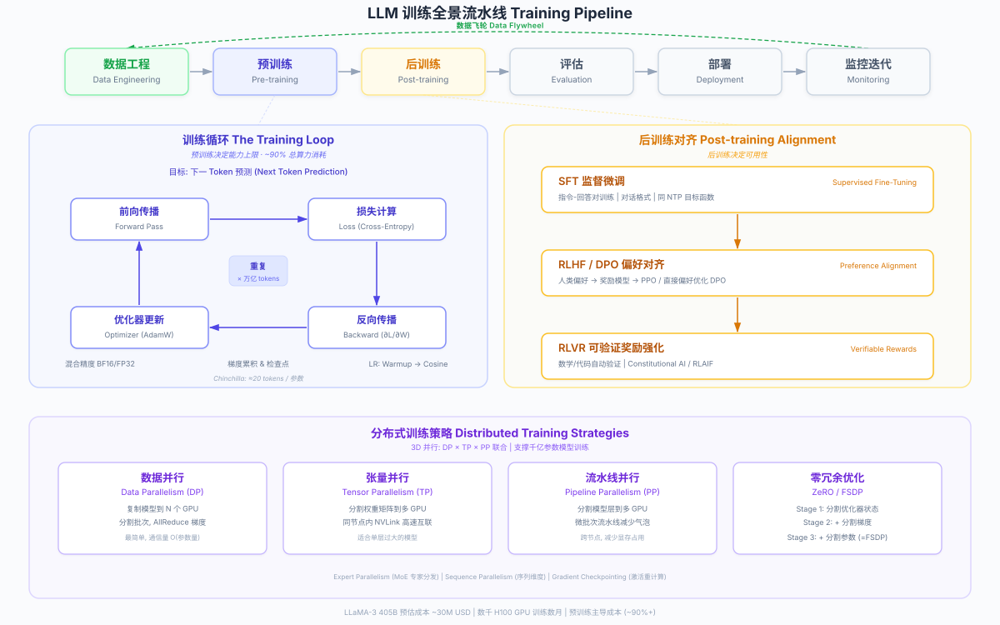

# LLM 训练全流程深度解析：从数据到模型

> 本文系统梳理大语言模型（LLM）从原始数据到可部署模型的完整训练流水线，重点拆解预训练核心循环（Forward → Loss → Backward → Optimizer）、分布式训练策略与后训练对齐方法的技术本质，并提供关键公式推导与工程实践要点。



---

## 1. 概述：训练与推理的本质区别

LLM 训练（Training）是指通过大规模数据驱动模型参数迭代更新的过程。与推理阶段的核心差异在于：

| 维度 | Training | Inference |
|------|----------|-----------|
| **核心操作** | Forward Pass + Backward Pass + Weight Update | 仅 Forward Pass |
| **权重状态** | 持续更新（梯度下降） | 冻结不变 |
| **计算模式** | 全程 Compute-bound（大 Batch GEMM 操作） | Prefill Compute-bound + Decode Memory-bandwidth-bound |
| **内存需求** | 极高：模型参数 + 梯度 + 优化器状态 + 激活值（约 16-20x 参数量） | 较低：模型参数 + KV Cache |
| **并行度** | 大批量数据并行，吞吐优先 | 单请求或小批量，延迟敏感 |
| **目标函数** | 最小化损失函数 $L(\theta)$ | 生成最优下一个 token |
| **持续时间** | 数周到数月 | 毫秒到秒级 |

训练与推理共享同一个 Forward Pass 计算路径——推理本质上就是"没有 Backward Pass 的训练"。训练阶段需要额外保存 Forward Pass 中每一层的中间激活值（Activations），因为 Backward Pass 的梯度计算依赖这些值，这使得训练的内存占用约为推理的 2 倍以上。

> 关于推理流水线的详细分析，参见 [LLM 推理全流程深度解析](llm-inference-pipeline.md)

---

## 2. 完整流水线：六大阶段全景

一个 LLM 从零到可部署，依次经历以下六个阶段：

| 阶段 | 名称 | 核心任务 | 计算占比 | 典型耗时 |
|------|------|----------|----------|----------|
| 1 | **Data Engineering** | 数据收集、清洗、去重、分词、混合 | - | 数周 |
| 2 | **Pre-training** | 自监督学习，NTP 目标，大规模参数训练 | ~90%+ | 数周到数月 |
| 3 | **Post-training** | 对齐（SFT → RLHF/DPO → RLVR） | ~5-10% | 数天到数周 |
| 4 | **Evaluation** | Benchmark 评测 + 人类评估 + 安全红队测试 | - | 持续进行 |
| 5 | **Deployment** | 量化、推理优化、服务部署 | - | 数天 |
| 6 | **Monitoring & Iteration** | 线上监控、用户反馈、数据飞轮 | - | 持续进行 |

### 2.1 Data Engineering（数据工程）

从互联网和专业语料库收集原始文本，经过多轮清洗、去重和质量过滤，构建高质量预训练语料。数据质量直接决定模型能力上限——"Garbage In, Garbage Out"在 LLM 训练中尤为适用。

### 2.2 Pre-training（预训练）

在海量无标注文本上进行自监督学习，通过 Next Token Prediction（NTP）目标训练模型理解语言的统计规律。这是计算量最大、成本最高的阶段，也是模型知识和能力的主要来源。

### 2.3 Post-training（后训练）

通过 SFT、RLHF、DPO 等技术将预训练的"基座模型"对齐为可交互的"助手模型"。后训练不改变模型的知识边界，但显著改变模型的行为模式。

### 2.4 Evaluation（评估）

通过标准化 Benchmark（MMLU、GSM8K、HumanEval 等）、人类评估（Chatbot Arena）和安全红队测试，全面评估模型能力和安全性。

### 2.5 Deployment（部署）

将训练好的模型经过量化压缩、推理优化后部署到生产环境。详见 [LLM 推理全流程深度解析](llm-inference-pipeline.md)。

### 2.6 Monitoring & Iteration（监控与迭代）

上线后持续监控模型表现，收集用户反馈和对话数据，构建数据飞轮，驱动下一轮训练迭代。

---

## 3. 数据工程深度解析

数据工程是 LLM 训练中最容易被低估、但对最终效果影响最大的阶段。Chinchilla 的研究表明，在固定计算预算下数据量与模型参数量同样重要；LIMA（"Less Is More for Alignment"）进一步证明，少量高质量数据的微调效果可以超越大量低质量数据。

### 3.1 数据源

| 数据源 | 规模 | 特点 | 代表性用途 |
|--------|------|------|------------|
| **CommonCrawl** | PB 级 | 互联网爬取，覆盖广但噪声大 | 通用语言知识 |
| **GitHub** | TB 级 | 高质量代码，含注释和文档 | 代码生成、逻辑推理 |
| **Wikipedia** | 数十 GB | 结构化百科知识，质量高 | 事实性知识 |
| **Books** | 数百 GB | 长文本、连贯叙事 | 长距离依赖建模 |
| **arXiv / Papers** | 数十 GB | 学术论文，数学符号丰富 | 科学推理、数学能力 |
| **StackOverflow** | 数十 GB | 问答对形式，技术知识密集 | 技术问答能力 |
| **多语言语料** | 变化大 | 不同语言的文本数据 | 多语言能力 |

### 3.2 数据清洗

数据清洗是一个多级 Pipeline，典型流程如下：

**规则过滤（Rule-based Filtering）**：
- 移除 HTML 标签、boilerplate 导航文本
- 过滤过短文档（通常 < 50 tokens）和过长重复文档
- 移除含有敏感/有害内容的文档（关键词黑名单 + URL 黑名单）
- 语言检测过滤（fastText 分类器）
- 过滤低质量文本：全大写、过多特殊字符、过高/过低 perplexity

**分类器过滤（Classifier-based Filtering）**：
- 训练一个二分类器（如 fastText）区分"高质量"vs"低质量"文本
- 正样本：Wikipedia、书籍等高质量文本
- 负样本：随机 CommonCrawl 样本
- 根据分类器概率打分进行过滤或加权采样

### 3.3 去重（Deduplication）

重复数据会导致模型过拟合，降低泛化能力，且浪费计算资源。

| 去重方法 | 原理 | 粒度 | 计算成本 |
|----------|------|------|----------|
| **Exact Dedup** | 基于文档/段落的精确哈希匹配 | 文档级 | 低 |
| **MinHash LSH** | Locality-Sensitive Hashing 近似检测 Jaccard 相似度 | 文档级 | 中 |
| **Suffix Array** | 基于后缀数组检测长重复子串 | 子串级 | 高 |
| **SemDedup** | 基于 Embedding 的语义去重 | 语义级 | 高 |

**MinHash 去重流程**：
1. 将文档分词为 n-gram 集合
2. 对每个集合计算 k 个 MinHash 签名
3. 通过 LSH 将签名相近的文档放入相同的 bucket
4. 在每个 bucket 内做精确 Jaccard 相似度比较
5. 超过阈值（如 0.8）的文档对标记为重复

### 3.4 Tokenization（分词）

分词将原始文本转换为模型可处理的 token ID 序列，是连接文本世界与数学世界的桥梁。

**主流算法**：
- **BPE（Byte Pair Encoding）**：GPT 系列使用。从字符级开始，迭代合并最频繁的 token 对
- **SentencePiece**：LLaMA 系列使用。将分词视为无监督分词模型，支持 BPE 和 Unigram 两种模式
- **Byte-level BPE**：GPT-2+ 采用。以 byte 为基本单元，天然支持任意语言和字符

**词表设计**：
- 词表大小通常在 32K-150K 之间（LLaMA-3: 128K, GPT-4: ~100K）
- 词表过小：需要更多 token 表示同一文本，增加序列长度
- 词表过大：Embedding 层参数量膨胀，稀有 token 训练不充分
- 多语言模型需要平衡不同语言的 token 效率

### 3.5 数据混合（Data Mixture）

不同类型数据的混合比例直接影响模型在各领域的能力表现。

| 数据类型 | 典型占比 | 影响的模型能力 |
|----------|----------|----------------|
| Web text | 50-60% | 通用语言理解 |
| Code | 10-20% | 代码生成、逻辑推理 |
| Math | 5-10% | 数学推理 |
| Books | 5-10% | 长文本理解、叙事能力 |
| Academic papers | 5-10% | 科学知识、专业术语 |
| Multilingual | 5-15% | 多语言能力 |
| Conversations | 2-5% | 对话能力 |

### 3.6 Curriculum Learning（课程学习）

类似人类学习从简到难的过程，在训练不同阶段改变数据组成：

1. **早期阶段**：以通用 Web 文本为主，建立语言基础
2. **中期阶段**：逐渐增加代码、数学等高质量结构化数据的比例
3. **后期阶段**：加大高质量数据（书籍、论文、精选 Web 内容）的权重
4. **Annealing（退火阶段）**：在训练尾声使用极高质量数据子集，同时降低学习率

LLaMA-3 的训练报告明确描述了这种分阶段数据混合策略，尤其在最后阶段上采样高质量数据对 Benchmark 表现有显著提升。

---

## 4. 预训练深度解析

预训练是 LLM 训练中计算量最大、耗时最长、成本最高的阶段，也是模型获取知识和能力的主要途径。

### 4.1 训练目标：Next Token Prediction（NTP）

NTP 是几乎所有现代 LLM 的预训练目标——给定一个 token 序列的前缀，预测下一个 token。

**形式化定义**：给定长度为 $T$ 的 token 序列 $x = (x_1, x_2, \ldots, x_T)$，训练目标是最大化条件概率的对数似然：

$$
\mathcal{L}(\theta) = -\sum_{t=1}^{T} \log P(x_t \mid x_{<t}; \theta)
$$

其中 $\theta$ 为模型参数，$x_{<t} = (x_1, \ldots, x_{t-1})$ 为位置 $t$ 之前的所有 token。

**本质**：NTP 等价于**交叉熵损失**（Cross-Entropy Loss）——模型输出一个 vocab_size 维的概率分布，与真实的 one-hot 分布之间的交叉熵即为损失值。NTP 目标虽然简单，但足以驱动模型学习语法、语义、世界知识乃至推理能力。

### 4.2 训练核心循环（The Training Loop）

预训练的核心是一个不断重复的五步循环，直到遍历数十万亿个 token：

```
for each batch of tokens:
    1. Forward Pass    → 计算预测概率分布
    2. Loss Computation → 计算预测与真实的差距
    3. Backward Pass   → 反向传播计算梯度
    4. Optimizer Step  → 用梯度更新模型权重
    5. LR Schedule     → 调整学习率
```

以下逐步深度拆解。

#### Step 1: Forward Pass（前向传播）

Forward Pass 与推理阶段的 Prefill 完全相同——将一个 batch 的 token 序列送入模型，逐层通过 Transformer 的所有层，得到每个位置的 logits 输出。

```
Input tokens [B, S]                              // B=batch size, S=sequence length
  → Embedding Layer → [B, S, d_model]            // token + position embedding
  → Transformer Layer 1                           
    → RMSNorm → Multi-Head Attention → Residual
    → RMSNorm → SwiGLU FFN → Residual
  → Transformer Layer 2
    → ...
  → Transformer Layer L                           // L 层堆叠
  → RMSNorm → Linear(d_model → vocab_size)       // 语言模型头
  → logits [B, S, vocab_size]                     // 每个位置的未归一化概率
```

**关键区别**：训练时必须**保存每一层的中间激活值**（Activations），用于后续 Backward Pass 的梯度计算。这是训练内存远高于推理的根本原因。

#### Step 2: Loss Computation（损失计算）

将 logits 与 ground truth 的 next token 计算 Cross-Entropy Loss：

```
logits[B, S, vocab_size]  →  softmax  →  P(x_t | x_{<t})
labels[B, S]              →  取 logits 中 label 对应位置的概率
Loss = -mean(log P(x_t = label_t))
```

实际实现中，softmax 和 cross-entropy 被融合为一个 numerically stable 的 `log_softmax + NLLLoss` 操作（PyTorch 的 `F.cross_entropy`），避免先计算 softmax 再取 log 的数值不稳定。

#### Step 3: Backward Pass（反向传播）

反向传播是训练独有的操作——从损失函数出发，利用**链式法则（Chain Rule）**逐层计算损失对每个参数的梯度：

$$
\frac{\partial \mathcal{L}}{\partial W_l} = \frac{\partial \mathcal{L}}{\partial a_L} \cdot \frac{\partial a_L}{\partial a_{L-1}} \cdots \frac{\partial a_{l+1}}{\partial a_l} \cdot \frac{\partial a_l}{\partial W_l}
$$

其中 $a_l$ 为第 $l$ 层的激活值。

**计算过程**：
1. 从最后一层（Loss → logits）开始，计算 $\frac{\partial \mathcal{L}}{\partial \text{logits}}$
2. 逆序遍历每一层 Transformer：利用该层在 Forward Pass 中保存的激活值，计算该层参数的梯度
3. 每个参数 $W$ 得到一个与自身同形状的梯度张量 $\frac{\partial \mathcal{L}}{\partial W}$

**计算量**：Backward Pass 的 FLOPs 约为 Forward Pass 的 **2 倍**（因为需要计算对输入的梯度和对参数的梯度两路），所以一个完整训练 step 的计算量约为 Forward 的 3 倍（1x Forward + 2x Backward），即每个 token 约 $6P$ FLOPs（$P$ 为参数量）。

**内存需求**：需要存储所有层的中间激活值，直到该层的梯度计算完成后才能释放。这是训练内存的最大消耗项之一。

#### Step 4: Optimizer Step（优化器更新）

使用优化器根据梯度更新模型权重。现代 LLM 训练标准使用 **AdamW**（Adam with decoupled weight decay）：

**AdamW 更新规则**：

$$
\begin{aligned}
m_t &= \beta_1 \cdot m_{t-1} + (1 - \beta_1) \cdot g_t & \text{(一阶动量：梯度的指数移动平均)} \\
v_t &= \beta_2 \cdot v_{t-1} + (1 - \beta_2) \cdot g_t^2 & \text{(二阶动量：梯度平方的指数移动平均)} \\
\hat{m}_t &= \frac{m_t}{1 - \beta_1^t} & \text{(偏差校正)} \\
\hat{v}_t &= \frac{v_t}{1 - \beta_2^t} & \text{(偏差校正)} \\
W_t &= W_{t-1} - \eta \cdot \left( \frac{\hat{m}_t}{\sqrt{\hat{v}_t} + \epsilon} + \lambda \cdot W_{t-1} \right) & \text{(参数更新 + weight decay)}
\end{aligned}
$$

其中：
- $g_t = \frac{\partial \mathcal{L}}{\partial W}$ 为当前 step 的梯度
- $\beta_1 = 0.9$, $\beta_2 = 0.95$（典型值）
- $\epsilon = 10^{-8}$（防止除零）
- $\eta$ 为学习率（由 LR Schedule 控制）
- $\lambda$ 为 weight decay 系数（典型值 0.1）

**内存影响**：AdamW 为每个参数维护 $m$（一阶动量）和 $v$（二阶动量）两个状态张量，加上梯度和参数本身。对于 FP32 精度，每个参数需要：$4 \text{(param)} + 4 \text{(grad)} + 4 \text{(m)} + 4 \text{(v)} = 16$ bytes。对于 70B 模型，仅优化器状态就需要约 560 GB。

#### Step 5: Learning Rate Schedule（学习率调度）

学习率的变化策略对训练稳定性至关重要，现代 LLM 标准采用 **Warmup + Cosine Decay**：

```
LR Schedule:
│
│  peak_lr ─────╮
│  ╱              ╲
│ ╱ warmup         ╲  cosine decay
│╱                   ╲
│                      ╲───── min_lr
├──────────────────────────────→ steps
  warmup_steps        total_steps
```

- **Warmup 阶段**：从极小学习率线性增长到 peak LR（如 $3 \times 10^{-4}$），持续约 2000 steps。避免训练初期梯度过大导致发散
- **Cosine Decay 阶段**：按余弦函数平滑衰减到 min LR（通常为 peak LR 的 1/10）
- **公式**：$\eta_t = \eta_{\min} + \frac{1}{2}(\eta_{\max} - \eta_{\min})(1 + \cos(\frac{t - t_w}{T - t_w} \pi))$

### 4.3 Mixed Precision Training（混合精度训练）

直接用 FP32 训练大模型在内存和计算上都不可行。混合精度训练是现代 LLM 训练的标配：

| 精度 | 用途 | 位宽 | 说明 |
|------|------|------|------|
| **FP32** | Master weights + Optimizer states | 32 bit | 确保数值精度，参数更新不丢失 |
| **BF16** | Forward + Backward 计算 | 16 bit | 与 FP32 相同指数范围，避免溢出 |
| **FP16** | Forward + Backward 计算（较少用） | 16 bit | 动态范围小，需要 Loss Scaling |

**工作流程**：
1. 维护 FP32 的 Master Weights（高精度参数副本）
2. Forward/Backward 使用 BF16 精度计算（速度翻倍，内存减半）
3. 梯度计算完成后，转换为 FP32 更新 Master Weights
4. 将更新后的 Master Weights 转回 BF16 进行下一次 Forward

**BF16 vs FP16**：BF16（Brain Floating Point）保留了与 FP32 相同的 8-bit 指数位，动态范围更大，训练中几乎不需要 Loss Scaling，因此 BF16 已成为主流选择（需 Ampere 及以上 GPU 架构）。

### 4.4 Gradient Accumulation（梯度累积）

当目标 batch size 过大，无法一次放入 GPU 显存时，使用梯度累积模拟大 batch：

```
effective_batch_size = micro_batch_size × num_accumulation_steps × num_GPUs

for step in range(num_accumulation_steps):
    loss = forward(micro_batch[step])
    loss = loss / num_accumulation_steps   # 归一化
    loss.backward()                        # 梯度累加到 .grad 中

optimizer.step()   # 在累积后的梯度上做一次更新
optimizer.zero_grad()
```

例如：目标 batch 为 4M tokens，单卡只能放 32K tokens，使用 128 GPUs 时需要 $\frac{4M}{32K \times 128} = 1$ 次梯度累积步。

### 4.5 Gradient Checkpointing（梯度检查点 / 激活重计算）

激活值的存储是训练内存的主要消耗之一。Gradient Checkpointing 通过**用计算换内存**来解决：

- **标准模式**：Forward 时保存全部 L 层的激活值 → 内存 $O(L)$
- **Checkpointing 模式**：仅保存每隔 $\sqrt{L}$ 层的激活值（checkpoint），Backward 到需要时再局部重计算 → 内存 $O(\sqrt{L})$，但计算量增加约 33%

实际中通常在每个 Transformer 层的边界设置 checkpoint，这是内存节省与计算开销之间的最佳平衡点。

### 4.6 模型架构选择

现代 LLM 几乎全部采用 **Decoder-only Transformer** 架构，具体组件选择：

| 组件 | 选择 | 代替方案 | 代表模型 |
|------|------|----------|----------|
| **架构** | Decoder-only | Encoder-Decoder（T5） | GPT、LLaMA、Qwen |
| **位置编码** | RoPE | Learned、ALiBi | LLaMA、Qwen |
| **归一化** | RMSNorm (Pre-Norm) | LayerNorm (Post-Norm) | LLaMA-2+ |
| **FFN 激活** | SwiGLU | ReLU、GELU | LLaMA、PaLM |
| **注意力** | GQA (Grouped-Query Attention) | MHA、MQA | LLaMA-2 70B+ |
| **稀疏化** | MoE (Mixture of Experts) | Dense | Mixtral、DeepSeek-V3 |

**MoE（Mixture of Experts）**：将每层的 FFN 替换为多个 Expert FFN + 一个 Router。每个 token 仅激活 Top-K 个 Expert（如 Top-2），使得模型总参数量极大但每个 token 的激活参数量（Active Parameters）可控。DeepSeek-V3 总参数 671B 但仅激活 37B。

### 4.7 Scaling Laws（缩放定律）

Scaling Laws 揭示了模型性能与计算资源之间的幂律关系，是决定训练资源分配的核心理论基础。

**Kaplan et al. (2020)** 发现 Loss 与模型参数 $N$ 和训练数据量 $D$ 遵循幂律：

$$
L(N, D) = \left(\frac{N_c}{N}\right)^{\alpha_N} + \left(\frac{D_c}{D}\right)^{\alpha_D} + L_\infty
$$

其中 $\alpha_N \approx 0.076$，$\alpha_D \approx 0.095$，$L_\infty$ 为不可约损失。

**Chinchilla Scaling Law (Hoffmann et al., 2022)** 修正了 Kaplan 的结论：

- **核心发现**：给定计算预算 $C$，最优分配方案是模型参数 $N$ 和训练 token 数 $D$ 等比例缩放
- **最优比例**：$D \approx 20N$（每个参数约需 20 个训练 token）
- **实践意义**：LLaMA-1 7B 训练了 1T tokens（远超 Chinchilla 建议的 140B），被称为"过训练"（over-trained）——这在推理成本敏感的场景下反而更优，因为较小模型的推理成本更低

**计算预算估算**：

$$
C \approx 6 \times N \times D \quad \text{(FLOPs)}
$$

其中 $6 = 1 \text{(forward)} + 2 \text{(backward)}$ 乘以每个 token 约 $2P$ FLOPs 的系数。例如 LLaMA-3 405B 训练 15T tokens：$C \approx 6 \times 405 \times 10^9 \times 15 \times 10^{12} \approx 3.6 \times 10^{25}$ FLOPs。

---

## 5. 后训练深度解析

后训练（Post-training）将预训练得到的"基座模型"（Base Model）转变为可以与人类交互的"助手模型"（Chat Model）。核心目标是**对齐**（Alignment）——让模型的行为符合人类的意图和价值观。

### 5.1 SFT（Supervised Fine-Tuning，监督微调）

**目标**：用高质量的 instruction-response 对训练模型遵循指令。

**训练方式**：与预训练完全相同的 NTP 目标，但训练数据格式不同：

```
<|system|>你是一个有帮助的助手。<|end|>
<|user|>解释量子计算的基本原理。<|end|>
<|assistant|>量子计算利用量子比特（qubit）的叠加态和纠缠态...<|end|>
```

**关键细节**：
- 通常只在 assistant 的回复部分计算 Loss（mask 掉 system/user 部分），避免让模型学习"生成用户问题"
- 数据量远小于预训练（通常 10K-100K 条高质量数据），但质量要求极高
- 学习率比预训练低一个数量级（如 $2 \times 10^{-5}$），避免"灾难性遗忘"
- LIMA 论文证明仅 1000 条精选数据即可实现显著对齐效果

### 5.2 RLHF（Reinforcement Learning from Human Feedback）

RLHF 是第一个成功将人类偏好注入 LLM 的方法，由 InstructGPT/ChatGPT 推广。分为三步：

**Step 1: 收集人类偏好数据**
- 给定 prompt，让 SFT 模型生成多个候选回复
- 人类标注员对候选回复进行排序（如 $y_w \succ y_l$ 表示 $y_w$ 优于 $y_l$）

**Step 2: 训练 Reward Model（RM）**
- 基于 SFT 模型初始化，移除语言模型头，替换为标量输出头
- 使用 Bradley-Terry 模型训练：

$$
\mathcal{L}_{\text{RM}} = -\mathbb{E}_{(x, y_w, y_l)} \left[ \log \sigma \left( r_\phi(x, y_w) - r_\phi(x, y_l) \right) \right]
$$

其中 $r_\phi(x, y)$ 为 RM 对 prompt $x$ 和回复 $y$ 给出的标量奖励。

**Step 3: PPO 策略优化**
- 使用 Reward Model 的输出作为奖励信号，通过 PPO 算法优化策略模型（即 LLM）：

$$
\mathcal{L}_{\text{PPO}} = \mathbb{E}_{x \sim \mathcal{D},\, y \sim \pi_\theta} \left[ r_\phi(x, y) - \beta \cdot D_{\text{KL}}\left(\pi_\theta(y|x) \| \pi_{\text{ref}}(y|x)\right) \right]
$$

- KL 散度惩罚项防止策略模型偏离 SFT 模型太远（避免 reward hacking）
- 需要同时运行 4 个模型：策略模型、参考模型（冻结的 SFT）、Reward Model、Value Model

### 5.3 DPO（Direct Preference Optimization）

DPO 跳过了 Reward Model 的训练，直接从偏好数据优化策略模型：

$$
\mathcal{L}_{\text{DPO}} = -\mathbb{E}_{(x, y_w, y_l)} \left[ \log \sigma \left( \beta \left( \log \frac{\pi_\theta(y_w|x)}{\pi_{\text{ref}}(y_w|x)} - \log \frac{\pi_\theta(y_l|x)}{\pi_{\text{ref}}(y_l|x)} \right) \right) \right]
$$

**与 RLHF 的关系**：DPO 在数学上等价于 RLHF（在 Bradley-Terry 偏好模型假设下），但将 RM 训练和 RL 优化合并为一个 supervised learning 目标，大幅简化了训练流程——只需两个模型（策略模型 + 参考模型）。

### 5.4 RLVR（Reinforcement Learning with Verifiable Rewards）

RLVR 是后训练的前沿方向，由 DeepSeek-R1 推广，专门用于提升模型的推理能力。

**核心思想**：对于数学和代码等可验证问题，不需要人类标注或 Reward Model，直接用**程序化验证**作为奖励信号：

- **数学题**：检查最终数值答案是否正确（与标准答案比较）
- **代码题**：运行测试用例，检查输出是否通过
- **逻辑推理**：验证推理步骤的逻辑一致性

**与 RLHF 的区别**：
- RLHF 的奖励来自 Reward Model（学习人类偏好的近似），存在 reward hacking 风险
- RLVR 的奖励来自客观验证（答案对/错），奖励信号无噪声
- RLVR 可以实现 self-play 式的自我迭代改进（模型生成 → 验证 → 强化 → 再生成）

**代表模型**：OpenAI o1/o3、DeepSeek-R1 使用大规模 RLVR 训练，使模型学会了 Chain-of-Thought 推理、自我纠错和反思等能力。

### 5.5 后训练方法对比

| 维度 | SFT | RLHF | DPO | RLVR |
|------|-----|------|-----|------|
| **数据需求** | Instruction-response 对 | 人类偏好排序 | 人类偏好对 | 可验证问题 + 答案 |
| **训练复杂度** | 低（标准 NTP） | 高（4 个模型） | 中（2 个模型） | 中-高（RL + 验证器） |
| **奖励信号** | 无（直接模仿） | Reward Model（近似） | 隐式（偏好对比） | 程序化验证（精确） |
| **Reward Hacking 风险** | 无 | 高 | 中 | 低 |
| **擅长领域** | 指令遵循、格式控制 | 通用偏好对齐 | 通用偏好对齐 | 数学、代码推理 |
| **代表应用** | 所有 Chat 模型的第一步 | InstructGPT, ChatGPT | LLaMA-2, Zephyr | o1, DeepSeek-R1 |

---

## 6. 分布式训练策略

单张 GPU 无法承载现代 LLM 的训练——一个 70B 参数模型仅 FP16 权重就需要 140 GB，加上梯度和优化器状态总计超过 1 TB。分布式训练通过将计算和存储分摊到成百上千张 GPU 上来解决这一问题。

### 6.1 Data Parallelism（数据并行，DP）

最基础的并行策略：将模型**完整复制**到每张 GPU 上，将 batch 拆分给不同 GPU 处理，然后同步梯度。

```
GPU 0: Model copy + Batch[0:B/N]  → gradients_0 ─┐
GPU 1: Model copy + Batch[B/N:2B/N] → gradients_1 ─┤ AllReduce → avg gradients
GPU 2: Model copy + Batch[2B/N:3B/N] → gradients_2 ─┤              ↓
GPU N: Model copy + Batch[...] → gradients_N ─┘    Weight Update
```

- **通信操作**：AllReduce 同步所有 GPU 的梯度
- **限制**：每张 GPU 必须能放下完整模型（参数 + 梯度 + 优化器状态），对大模型不适用
- **效率**：近线性加速（通信开销随 GPU 数量增长）

### 6.2 Tensor Parallelism（张量并行，TP）

将单层内的权重矩阵**按列或按行切分**到多张 GPU 上，每张 GPU 负责矩阵的一部分计算。

```
Attention Layer: W_Q [d, d] → split across GPUs
  GPU 0: W_Q[:, 0:d/N]    → Q_partial_0
  GPU 1: W_Q[:, d/N:2d/N] → Q_partial_1
  ...
  → AllReduce 合并结果
```

- **适用范围**：同一节点内的 GPU（依赖 NVLink 高带宽互连）
- **典型 TP 度**：2-8（一个节点内的 GPU 数量）
- **通信模式**：每层需要 2 次 AllReduce（Attention + FFN），通信频繁但数据量小

### 6.3 Pipeline Parallelism（流水线并行，PP）

将模型的不同层分配到不同 GPU 上，形成流水线。

```
GPU 0: Layers 0-19   →  GPU 1: Layers 20-39  →  GPU 2: Layers 40-59  →  GPU 3: Layers 60-79
     Micro-batch 1 ──→  Micro-batch 1 ──→  Micro-batch 1 ──→  Micro-batch 1
     Micro-batch 2 ──→  Micro-batch 2 ──→  ...
```

- **关键技术**：将 batch 拆分为多个 micro-batch，当第一个 micro-batch 前进到第二个 GPU 时，第二个 micro-batch 开始在第一个 GPU 上计算，形成流水线
- **Bubble（流水线气泡）**：流水线启动和排空阶段 GPU 存在空闲，效率损失为 $(P-1)/(P-1+M)$，其中 $P$ 为 PP 度，$M$ 为 micro-batch 数量。增大 $M$ 可减少 bubble
- **通信模式**：仅相邻 GPU 之间传递激活值，通信量较少，适合跨节点

### 6.4 Sequence Parallelism（序列并行，SP）

在序列维度上对 LayerNorm 和 Dropout 等操作进行并行化。这些操作不涉及权重矩阵，Tensor Parallelism 无法覆盖：

- 将 LayerNorm 和 Dropout 的输入沿序列维度切分到多张 GPU
- 与 TP 互补使用，消除 TP 中剩余的冗余计算和内存
- 由 Megatron-LM 提出

### 6.5 ZeRO（Zero Redundancy Optimizer）

ZeRO 通过将优化器状态、梯度和参数**分片存储**到多张 GPU 上，消除数据并行的内存冗余：

| ZeRO Stage | 分片内容 | 每 GPU 内存 (70B, FP16, 64 GPUs) | 说明 |
|------------|----------|----------------------------------|------|
| **Stage 0** | 无（标准 DP） | ~1120 GB | 完整的参数 + 梯度 + 优化器状态 |
| **Stage 1** | Optimizer States | ~280 GB | 优化器状态 $m$, $v$ 分片 |
| **Stage 2** | + Gradients | ~210 GB | 梯度也分片 |
| **Stage 3** | + Parameters | ~17.5 GB | 参数也分片（= FSDP） |

- **Stage 1**：每张 GPU 只存储 $1/N$ 的优化器状态，更新参数时做 AllGather 获取完整参数
- **Stage 2**：在 Stage 1 基础上，梯度也分片存储，Reduce-Scatter 后每张 GPU 只保留自己负责的梯度分片
- **Stage 3**：在 Stage 2 基础上，模型参数也分片存储，Forward/Backward 时按需 AllGather 获取完整参数

**PyTorch FSDP（Fully Sharded Data Parallelism）** 是 ZeRO Stage 3 的 PyTorch 原生实现。

### 6.6 3D Parallelism

实际的大规模训练将 DP、TP、PP 三种并行策略组合使用：

```
3D 并行配置示例（LLaMA-3 405B, 16K GPUs）：
  TP = 8  （节点内 8 张 GPU，NVLink 互连）
  PP = 16 （跨 16 个 Pipeline stage）
  DP = 128（128 路数据并行）
  Total = 8 × 16 × 128 = 16,384 GPUs
```

- **TP**：在节点内切分权重矩阵（依赖高带宽 NVLink）
- **PP**：在节点间切分模型层（跨节点通信少）
- **DP**：在 PP 组间复制，切分 batch 数据

### 6.7 Expert Parallelism（专家并行）

针对 MoE（Mixture of Experts）模型的专门并行策略：

- 将不同 Expert 分配到不同 GPU 上
- 每个 token 经 Router 决定发送到哪些 Expert 所在的 GPU
- 需要 All-to-All 通信（token 跨 GPU 路由）
- 与 DP/TP/PP 组合形成"4D 并行"

### 6.8 分布式策略对比

| 策略 | 切分维度 | 通信操作 | 通信频率 | 适用场景 |
|------|----------|----------|----------|----------|
| **DP** | Batch | AllReduce 梯度 | 每步 1 次 | 模型能放入单卡 |
| **TP** | 权重矩阵列/行 | AllReduce 激活 | 每层 2 次 | 节点内高带宽互连 |
| **PP** | 模型层 | Point-to-point 激活 | 每 micro-batch 1 次 | 跨节点，模型层数多 |
| **SP** | 序列维度 | AllGather / ReduceScatter | 每层 | 与 TP 配合使用 |
| **ZeRO** | 优化器/梯度/参数 | AllGather / ReduceScatter | 每步 | 减少 DP 内存冗余 |
| **EP** | Expert 单元 | All-to-All | 每层（MoE 层） | MoE 模型 |

---

## 7. 训练稳定性与工程挑战

大规模 LLM 训练是一项极端的系统工程，需要在数千张 GPU 上持续运行数周到数月，任何一个环节的故障都可能导致灾难性后果。

### 7.1 Loss Spike（损失尖峰）

训练过程中突然出现 Loss 急剧上升的现象，可能原因：

- **数据问题**：遇到异常数据批次（极长序列、格式错乱、特殊编码）
- **数值不稳定**：FP16 下的梯度溢出（Gradient Overflow）
- **学习率问题**：学习率过大，参数更新步长超出损失曲面的稳定区域

**应对策略**：
- 数据质量层面的前置过滤
- Loss Spike 检测 + 自动跳过异常 batch
- Gradient Clipping（梯度裁剪）：将梯度的全局范数裁剪到阈值内（典型值 1.0）

### 7.2 Gradient Explosion / Vanishing（梯度爆炸 / 消失）

- **梯度爆炸**：梯度值指数级增长，导致 NaN/Inf，训练崩溃。通过 Gradient Clipping 缓解
- **梯度消失**：梯度值趋近于零，深层参数几乎不更新。Pre-Norm（在每层前做归一化）+ 残差连接 是有效缓解手段

### 7.3 Checkpointing 与故障恢复

数千 GPU 长时间运行，硬件故障（GPU 挂掉、网络中断、存储异常）是必然事件：

- **定期 Checkpoint**：每隔 N 步保存完整的训练状态（模型参数、优化器状态、LR 调度器状态、RNG 状态、数据加载器位置）
- **异步 Checkpoint**：将 checkpoint 保存操作与训练计算重叠，减少停顿时间
- **自动恢复**：故障检测后自动从最近的 checkpoint 恢复，替换故障节点
- **弹性训练**：支持 GPU 数量动态增减（如 PyTorch Elastic、NVIDIA Resiliency Framework）

### 7.4 NaN 检测

训练过程中出现 NaN（Not a Number）通常意味着数值灾难：

- 在 Forward/Backward 关键位置插入 NaN 检测
- 检测到 NaN 后立即停止当前 step，回滚到上一个 checkpoint
- 记录触发 NaN 的 batch 数据，用于后续分析

### 7.5 训练成本

| 模型 | 参数量 | 训练 Tokens | GPU | 估算成本 |
|------|--------|-------------|-----|----------|
| GPT-3 | 175B | 300B | ~1K V100 | ~$5M |
| LLaMA-2 70B | 70B | 2T | 2K A100 | ~$5-10M |
| LLaMA-3 405B | 405B | 15T | 16K H100 | ~$30M+ |
| GPT-4 | ~1.8T (estimated MoE) | ~13T (estimated) | ~25K A100 | ~$100M+ |

预训练占总训练计算的 90% 以上，是最主要的成本来源。

---

## 8. 评估体系

模型训练完成后，需要通过多维度评估来衡量其能力和安全性。

### 8.1 标准化 Benchmark

| Benchmark | 评估能力 | 评估方式 |
|-----------|----------|----------|
| **MMLU** | 通识知识（57 个学科） | 多选题准确率 |
| **GSM8K** | 小学数学推理 | 解题准确率 |
| **MATH** | 竞赛级数学 | 解题准确率 |
| **HumanEval / MBPP** | 代码生成 | Pass@K（生成代码通过测试用例） |
| **HellaSwag** | 常识推理 | 选择题准确率 |
| **ARC** | 科学推理 | 多选题准确率 |
| **TruthfulQA** | 真实性 | 回答真实性 + 信息量 |
| **WinoGrande** | 共指消解 | 准确率 |
| **IFEval** | 指令遵循 | 严格/宽松准确率 |

### 8.2 人类评估

- **Chatbot Arena (LMSYS)**：众包盲测平台，用户与两个匿名模型对话并选择更好的回复，基于 Elo/Bradley-Terry 模型计算排名
- **人工标注**：专业标注员按预定义标准评估模型输出的准确性、有用性和安全性
- **局限性**：人类评估成本高、主观性强、难以大规模复现

### 8.3 安全红队测试（Red-teaming）

- **对抗性测试**：专业红队成员尝试各种攻击手段（prompt injection、jailbreak、社会工程学等）
- **自动化红队**：使用另一个 LLM 自动生成对抗性 prompt
- **评估维度**：拒绝有害请求的能力、边界 case 处理、安全性与有用性的平衡

---

## 9. 关键公式速查

### 9.1 NTP Loss（Next Token Prediction 损失）

$$
\mathcal{L}_{\text{NTP}}(\theta) = -\frac{1}{T}\sum_{t=1}^{T} \log P(x_t \mid x_{<t};\, \theta) = -\frac{1}{T}\sum_{t=1}^{T} \log \frac{\exp(z_{x_t})}{\sum_{v=1}^{V} \exp(z_v)}
$$

其中 $z$ 为 logits 向量，$V$ 为词表大小。

### 9.2 AdamW 优化器

$$
\begin{aligned}
m_t &= \beta_1 m_{t-1} + (1-\beta_1) g_t \\
v_t &= \beta_2 v_{t-1} + (1-\beta_2) g_t^2 \\
\hat{m}_t &= m_t / (1 - \beta_1^t),\quad \hat{v}_t = v_t / (1 - \beta_2^t) \\
W_t &= W_{t-1} - \eta \left(\frac{\hat{m}_t}{\sqrt{\hat{v}_t}+\epsilon} + \lambda W_{t-1}\right)
\end{aligned}
$$

典型值：$\beta_1=0.9$，$\beta_2=0.95$，$\epsilon=10^{-8}$，$\lambda=0.1$。

### 9.3 Scaling Law

$$
L(N, D) = \left(\frac{N_c}{N}\right)^{\alpha_N} + \left(\frac{D_c}{D}\right)^{\alpha_D} + L_\infty
$$

**Chinchilla 最优比例**：$D_{\text{opt}} \approx 20N$（每个参数约 20 个训练 token）。

### 9.4 训练 FLOPs 估算

$$
C \approx 6 \times N \times D \quad \text{(total FLOPs for one epoch)}
$$

每个 token 的 Forward Pass 约 $2P$ FLOPs，加上 Backward 约 $4P$ FLOPs，总计 $\approx 6P$ FLOPs/token。

### 9.5 RLHF Reward Model Loss

$$
\mathcal{L}_{\text{RM}} = -\mathbb{E}_{(x, y_w, y_l)} \left[\log \sigma\!\left(r_\phi(x, y_w) - r_\phi(x, y_l)\right)\right]
$$

### 9.6 DPO Loss

$$
\mathcal{L}_{\text{DPO}} = -\mathbb{E}_{(x, y_w, y_l)} \left[\log \sigma\!\left(\beta \log \frac{\pi_\theta(y_w|x)}{\pi_{\text{ref}}(y_w|x)} - \beta \log \frac{\pi_\theta(y_l|x)}{\pi_{\text{ref}}(y_l|x)}\right)\right]
$$

### 9.7 训练内存估算（每参数）

| 组件 | 精度 | 每参数 Bytes |
|------|------|-------------|
| 参数（FP16/BF16） | 16-bit | 2 |
| 梯度（FP16/BF16） | 16-bit | 2 |
| Master Weights（FP32） | 32-bit | 4 |
| Adam $m$（FP32） | 32-bit | 4 |
| Adam $v$（FP32） | 32-bit | 4 |
| **合计** | — | **16** |

对于 70B 模型：$70 \times 10^9 \times 16 = 1120$ GB（不含激活值）。

---

## 10. 预训练 vs 后训练对比

| 维度 | Pre-training | Post-training |
|------|-------------|---------------|
| **目标** | 学习语言建模能力和世界知识 | 对齐人类偏好和行为模式 |
| **数据规模** | 万亿 token 级 | 万到十万条级 |
| **数据类型** | 无标注原始文本 | 高质量标注数据（instruction/preference） |
| **训练目标** | NTP（Cross-Entropy） | NTP (SFT) / RL 目标 (RLHF/DPO/RLVR) |
| **学习率** | 较高（$\sim 3 \times 10^{-4}$） | 较低（$\sim 2 \times 10^{-5}$） |
| **计算量** | 占总训练 90%+ | 占总训练 5-10% |
| **训练时长** | 数周到数月 | 数天到数周 |
| **改变的内容** | 模型的知识和基础能力 | 模型的行为模式和输出风格 |
| **类比** | 通识教育（学知识） | 职业培训（学如何做事） |

**核心洞察**：预训练决定了模型"知道什么"（知识边界），后训练决定了模型"怎么说"（行为边界）。后训练不会让模型获得预训练中没有见过的知识，但可以激活、对齐和精确控制模型已有的知识。

---

## 11. 总结：从训练到推理的完整闭环

LLM 训练是一个从原始数据到可部署模型的系统工程，其核心矛盾可以概括为：

- **数据工程**：在海量噪声数据中提炼高质量语料，数据质量直接决定模型能力上限
- **预训练核心循环**：Forward → Loss → Backward → Optimizer 四步循环，在数万亿 token 上迭代，通过简单的 NTP 目标涌现出复杂的语言理解和推理能力
- **分布式训练**：将单机不可能完成的计算分摊到成千上万张 GPU 上，3D 并行（DP × TP × PP）+ ZeRO 是当前的工业标准
- **后训练对齐**：通过 SFT → RLHF/DPO → RLVR 的渐进式对齐，将"知识丰富但行为不可控"的基座模型转变为"安全、有用、诚实"的助手模型

训练完成后，模型进入推理阶段——训练的 Forward Pass 成为推理的全部计算，KV Cache 消除了重复计算，量化和 Speculative Decoding 等技术进一步优化延迟和吞吐。从训练到推理，是从"学会能力"到"运用能力"的转变，二者共享同一个 Transformer 前向传播路径，但面临截然不同的计算瓶颈和优化方向。
