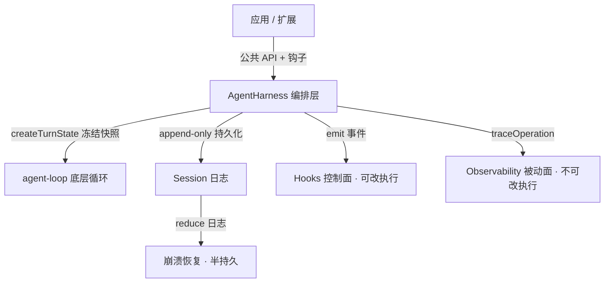

- 定义了 AgentEvent，管理生命周期

```tsx
/**
 * Events emitted by the Agent for UI updates.
 *
 * `agent_end` is the last event emitted for a run, but awaited `Agent.subscribe()`
 * listeners for that event are still part of run settlement. The agent becomes
 * idle only after those listeners finish.
 */
export type AgentEvent =
	// Agent lifecycle
	| { type: "agent_start" }
	| { type: "agent_end"; messages: AgentMessage[] }
	// Turn lifecycle - a turn is one assistant response + any tool calls/results
	| { type: "turn_start" }
	| { type: "turn_end"; message: AgentMessage; toolResults: ToolResultMessage[] }
	// Message lifecycle - emitted for user, assistant, and toolResult messages
	| { type: "message_start"; message: AgentMessage }
	// Only emitted for assistant messages during streaming
	| { type: "message_update"; message: AgentMessage; assistantMessageEvent: AssistantMessageEvent }
	| { type: "message_end"; message: AgentMessage }
	// Tool execution lifecycle
	| { type: "tool_execution_start"; toolCallId: string; toolName: string; args: any }
	| { type: "tool_execution_update"; toolCallId: string; toolName: string; args: any; partialResult: any }
	| { type: "tool_execution_end"; toolCallId: string; toolName: string; result: any; isError: boolean };
```


- 引入 turn，方便做 hook: Turn lifecycle - a turn is one assistant response + any tool calls/results

​	no toolcall

```
prompt("Hello")
├─ agent_start
├─ turn_start
├─ message_start   { message: userMessage }      // Your prompt
├─ message_end     { message: userMessage }
├─ message_start   { message: assistantMessage } // LLM starts responding
├─ message_update  { message: partial... }       // Streaming chunks
├─ message_update  { message: partial... }
├─ message_end     { message: assistantMessage } // Complete response
├─ turn_end        { message, toolResults: [] }
└─ agent_end       { messages: [...] }
```

with toolcall

```
prompt("Read config.json")
├─ agent_start
├─ turn_start
├─ message_start/end  { userMessage }
├─ message_start      { assistantMessage with toolCall }
├─ message_update...
├─ message_end        { assistantMessage }
├─ tool_execution_start  { toolCallId, toolName, args }
├─ tool_execution_update { partialResult }           // If tool streams
├─ tool_execution_end    { toolCallId, result }
├─ message_start/end  { toolResultMessage }
├─ turn_end           { message, toolResults: [toolResult] }
│
├─ turn_start                                        // Next turn
├─ message_start      { assistantMessage }           // LLM responds to tool result
├─ message_update...
├─ message_end
├─ turn_end
└─ agent_end
```

- tool 执行方式可配置，可以并行或者串行


老大，4 份文档读完了。它们是 `pi-agent-core` 中 **AgentHarness（高层编排层）** 的设计笔记——比 README 更深一层，讲的是「在 agent-loop 之上怎么做会话持久化、运行时配置、钩子、可观测性和崩溃恢复」。下面是提炼版。

---

# pi-agent-core · AgentHarness 设计精炼版

## 0. 一句话定位

`AgentHarness` 是 agent-loop 之上的**编排层**，独占五件事：**会话持久化、运行时配置、资源解析、操作锁（phase）、面向扩展的安全变更语义**。核心目标：让钩子/监听器能在事件回调里安全调用 harness 公共 API，而**不破坏在途快照、不打乱持久化顺序、不丢挂起写入、不死锁**。

---

## 1. AgentHarness 生命周期（agent-harness.md）

**四类状态（关键心智模型）**

| 状态           | 含义                                                       | 读写语义                                                     |
| -------------- | ---------------------------------------------------------- | ------------------------------------------------------------ |
| Harness config | 最新运行时配置（model/thinking/tools/resources/系统提示…） | getter 返回**最新配置**，非在途快照；setter 立即生效但只影响**下一轮** |
| Turn snapshot  | 单轮 LLM 调用冻结的具体状态，由 `createTurnState()` 创建   | 整轮逻辑共用同一快照；数组浅拷贝                             |
| Session        | **仅持久化条目**（append-only）                            | 读只返回已持久化状态，不含挂起写入                           |
| Pending writes | busy 期间请求的会话写入                                    | 排队，在 save point / 结算 / 失败清理时刷盘，**绝不丢弃**    |

**Phase 锁**：`idle | turn | compaction | branch_summary | retry`
- **结构性操作**（prompt / skill / promptFromTemplate / compact / navigateTree）要求 `idle`，否则 reject `"busy"`
- **turn 内允许**：steer / followUp / nextTurn / abort / 运行时 setter

**Save point**（核心机制）：一轮 assistant + 工具结果完成后 → ① 刷挂起写入 ② 若循环继续则建新快照 ③ 应用新 context/model/thinking 给下一轮。**让 turn 中途的配置变更影响下一轮，却永不改在途 provider 请求**。靠 `AssistantMessageStream` 解耦了 provider 传输与下游消费，所以 save-point 工作可直接 await，顺序确定。

**错误分层**：底层能力用 `Result<T,E>`（不抛）；高层编排（Session / AgentHarness）直接 throw，统一归一化为 `AgentHarnessError`（子系统错误挂 `cause`）。commit 后钩子失败不回滚，方法 reject code `"hook"`。

**Abort**：中止底层 run + 清 steer/followUp 队列；**不清** nextTurn 消息、**不丢**挂起写入。

---

## 2. Hooks 设计（hooks.md）

**核心思想：事件自带结果类型（type-only phantom），无结果映射表。**

```ts
interface HookEvent<TType, TResult = void> { type: TType; readonly [HookResult]?: TResult }
```

**双 API 分工**
- `observe()` — 看**所有**事件，只读，返回值忽略
- `on(type, handler)` — 参与该事件语义，可返回结果
- `emit(event)` — harness 唯一调用入口；harness 不存 handler、不懂扩展策略

**各事件的归约语义（reducer）**
| 事件                                 | 语义                           |
| ------------------------------------ | ------------------------------ |
| context / provider_request / payload | 顺序 transform，后者见前者输出 |
| before_agent_start                   | 收集注入消息 + 链式拼系统提示  |
| tool_call                            | 顺序，遇 `block` 早退          |
| tool_result                          | 顺序累积 patch，后者见前面补丁 |
| session_before_*                     | 顺序，遇 `cancel` 早退         |

**留的口子**：错误策略需显式（coding-agent 默认 `"continue"`）；需要 source 元数据（哪个扩展产生）→ 用 `createScope({sourceInfo})`；tools/commands/shortcuts 等是**注册表不是钩子**，不进 harness。

---

## 3. 可观测性（observability.md）

**目标：让 ai/agent 可观测，但不绑定 OTel/Sentry/Node API。**

**思路**：pi 只发**稳定结构化的生命周期事件**（start/end/error），外部 adapter 自行转成 OTel span / Sentry / 日志。

- 模型：trace（一棵因果树，如一次 turn）+ span（一次计时操作，用 ID 表示）
- 核心 API：`traceOperation(name, payload, fn)` 自动建 span、串父子、发 start/end/error
- 异步上下文：`AsyncLocalStorage`（Node 版 ThreadLocal）做**运行时 adapter**，不进核心抽象（要跑 Bun/浏览器/worker）
- **安全默认**：provider/model/token/cost/status 可发；prompt/completion/tool args/文件内容/key/headers **默认不发**
- 铁律：可观测订阅者是**被动的**，错误必须吞掉，绝不影响 pi 执行（与控制面的 hooks 区分）

事件名：`pi.agent.prompt` / `pi.agent.turn` / `pi.ai.provider.request` / `pi.session.append_entry` …

---

## 4. 持久化与崩溃恢复（durable-harness.md）

**定位：不追求「完全持久」，只做「半持久」**——因为 tools/model providers/扩展/系统提示回调都是宿主提供的运行时 JS，无法序列化。

**核心原则**
- **Session = 全部持久化状态**（不只是 transcript），单一 append-only 日志，不加 sidecar
- harness 只持久化**可序列化配置**（如 active tool **名字**），不存具体 tool 实现
- 恢复从**持久边界重启**，不从在途 provider 流恢复（provider 流不可续）
- 每个被接受的变更，**必须在公共 API resolve 前先持久化**

**恢复策略（默认保守）**
| 中断点                     | 处理                                                      |
| -------------------------- | --------------------------------------------------------- |
| 未完成 turn                | 标记 interrupted，保留队列/挂起写入，回 idle              |
| 未完成 provider 请求       | 标记 interrupted，**不自动重试**                          |
| 未完成 tool call           | 追加 error 结果；**仅当 tool 声明幂等/retry-safe 才重试** |
| 未完成 compaction / 树导航 | 无最终条目则重跑                                          |

宿主 resume 时须重建：model 注册表、tool 注册表、扩展集与顺序、资源加载器、系统提示、auth、app 钩子。

---

## 总览图



---

**贯穿四份文档的一条主线**：**「快照隔离 + append-only 日志 + 确定性顺序」**。在途请求用冻结快照保护，所有变更落成可归约的持久条目，钩子能改执行、观测只能旁观、恢复靠重放日志。这套设计让 harness 既可被扩展深度介入，又不会被并发/重入/崩溃搞乱状态。


它和我刚总结的那 4 份 docs 是**互补的两层**：

- **README**（你现在打开的这篇）：讲 **`Agent` 类 + 底层 `agentLoop`** 的**用法层**——事件序列、`convertToLlm`/`transformContext` 消息流、steering/follow-up、tools、`beforeToolCall`/`afterToolCall`、`terminate`、proxy、自定义消息类型。
- **docs/**（agent-harness / hooks / observability / durable）：讲 **`AgentHarness` 编排层**的**设计层**——会话持久化、phase 锁、save point、钩子归约、可观测性、崩溃恢复。

补充一个我从这篇 README 里抓到、但之前没强调的**关键细节**——它正好补全了你那个问题的边界：

> **`shouldStopAfterTurn`**：在 `turn_end` 之后、轮询 steering/follow-up 之前、启动下一次 LLM 调用之前触发。返回 `true` 就直接 `agent_end`，**但不中止 provider 流、不取消运行中的工具、不改 stop reason**。

这就是为什么「turn 切在工具之后」是有意为之——它给了一个「LLM 还没消费工具结果前就能优雅刹车」的窗口（典型用途：下一轮前发现该压缩上下文）。

还有一个 README 里值得记的对比点：

|      | 底层 `agentLoop()`                                   | `Agent` 类                                                   |
| ---- | ---------------------------------------------------- | ------------------------------------------------------------ |
| 事件 | 纯观察性，**不等**你的异步处理 settle 就继续下一阶段 | `message_end` 是 **barrier**，`beforeToolCall` 能看到已含该 assistant 消息的状态 |
| 适用 | 要极致控制                                           | 需要「消息处理先于工具预检」的顺序保证                       |


老大，要给出有价值的建议，我必须先搞清楚 dawn-ai 是什么、技术栈和架构——不能凭空套用 PI 的设计。先探查这个项目。 

Read [](file:///Users/junkangdu/projects/github/dawn-ai)

Java/Maven 项目，和 PI（TS agent harness）技术栈不同。我深入了解它的领域与架构，再做精准映射。    

探查 dawn-ai 架构

Read [](file:///Users/junkangdu/projects/github/dawn-ai/README.md)

Read [](file:///Users/junkangdu/projects/github/dawn-ai)

Read [](file:///Users/junkangdu/projects/github/dawn-ai/README.md)

Read [](file:///Users/junkangdu/projects/github/dawn-ai/pom.xml)

Read [](file:///Users/junkangdu/projects/github/dawn-ai/src/main/java)

Read [](file:///Users/junkangdu/projects/github/dawn-ai/src/main/java/com/dawn)

Read [](file:///Users/junkangdu/projects/github/dawn-ai/src/main/java/com/dawn/ai)

Read [](file:///Users/junkangdu/projects/github/dawn-ai/src/main/java/com/dawn/ai/memory)

Read [](file:///Users/junkangdu/projects/github/dawn-ai/src/main/java/com/dawn/ai/service)

Read [](file:///Users/junkangdu/projects/github/dawn-ai/src/main/java/com/dawn/ai/rag)

Read [](file:///Users/junkangdu/projects/github/dawn-ai/src/main/java/com/dawn/ai/agent)

Read [](file:///Users/junkangdu/projects/github/dawn-ai/src/main/java/com/dawn/ai/agent/orchestration)

Read [](file:///Users/junkangdu/projects/github/dawn-ai/src/main/java/com/dawn/ai/agent/tools)

Read [](file:///Users/junkangdu/projects/github/dawn-ai/src/main/java/com/dawn/ai/agent/registry)

Read [](file:///Users/junkangdu/projects/github/dawn-ai/src/main/java/com/dawn/ai/service/ChatService.java)

Read [](file:///Users/junkangdu/projects/github/dawn-ai/src/main/java/com/dawn/ai/service/MemoryService.java)

Read [](file:///Users/junkangdu/projects/github/dawn-ai/src/main/java/com/dawn/ai/agent/registry/ToolRegistry.java)

Read [](file:///Users/junkangdu/projects/github/dawn-ai/src/main/java/com/dawn/ai/agent/orchestration/AgentOrchestrator.java)

Read [](file:///Users/junkangdu/projects/github/dawn-ai/src/main/java/com/dawn/ai/agent/trace/StepCollector.java)

Read [](file:///Users/junkangdu/projects/github/dawn-ai/src/main/java/com/dawn/ai/agent/planning/TaskPlanner.java)

Read [](file:///Users/junkangdu/projects/github/dawn-ai/src/main/java/com/dawn/ai/agent/skill/Skill.java)

Read [](file:///Users/junkangdu/projects/github/dawn-ai/src/main/java/com/dawn/ai/agent/tools/KnowledgeSearchTool.java)

Searched for regex `TODO|FIXME|XXX|HACK|BUG` (`**/src/main/java/**/*.java`), no results

Read [](file:///Users/junkangdu/projects/github/dawn-ai/src/main/java/com/dawn/ai/config)

Read [](file:///Users/junkangdu/projects/github/dawn-ai/src/main/java/com/dawn/ai/agent/trace)

Read [](file:///Users/junkangdu/projects/github/dawn-ai/src/main/java/com/dawn/ai/agent/trace/ToolExecutionAspect.java)

Read [](file:///Users/junkangdu/projects/github/dawn-ai/src/main/java/com/dawn/ai/agent/subagent)

Read [](file:///Users/junkangdu/projects/github/dawn-ai/src/main/java/com/dawn/ai/rag/query)

Read [](file:///Users/junkangdu/projects/github/dawn-ai/src/main/java/com/dawn/ai/memory/MemoryConsolidator.java)

Read [](file:///Users/junkangdu/projects/github/dawn-ai/src/main/java/com/dawn/ai/agent/subagent/SubAgentExecutor.java)

Read [](file:///Users/junkangdu/projects/github/dawn-ai/src/main/java/com/dawn/ai/agent/skill)

Read [](file:///Users/junkangdu/projects/github/dawn-ai/src/main/java/com/dawn/ai/rag/RagService.java)

Read [](file:///Users/junkangdu/projects/github/dawn-ai/src/main/java/com/dawn/ai/config/AgentConfig.java)

Read [](file:///Users/junkangdu/projects/github/dawn-ai/src/main/java/com/dawn/ai/agent/skill/SkillRegistry.java)

Read [](file:///Users/junkangdu/projects/github/dawn-ai/src/main/java/com/dawn/ai/agent/subagent/SubAgentRegistry.java)

Searched for text `provider context window compression` (`**/src/main/java/com/dawn/ai/**/*.java`), no results

Read [](file:///Users/junkangdu/projects/github/dawn-ai/src/main/java/com/dawn/ai/agent/trace)

Read [](file:///Users/junkangdu/projects/github/dawn-ai/src/main/java/com/dawn/ai/config/AiConfig.java)

探查完成。读取 subagent 的完整发现。  

Read [](file:///Users/junkangdu/Library/Application%20Support/Code/User/workspaceStorage/adfa29ffe248b78f415305aa5ceac892/GitHub.copilot-chat/chat-session-resources/d2d67117-fb46-4e44-8fb1-dd70082f81d5/toolu_01EMfefa2rY5RvNS9Pq76YVg__vscode-1780623437432/content.txt#1-1), lines 1 to 300

老大，dawn-ai 我摸透了——它是 **Java 17 + Spring Boot 3.2 + Spring AI** 的生产级 Agent 框架（ReAct 循环 + RAG + 子代理 + 分层记忆）。它的痛点和 PI 的设计点**高度互补**。下面按 ROI 从高到低给你精准映射，全部基于已核验事实，不泛泛而谈。

---

## 高价值（直接补 dawn-ai 的硬伤）

### ① 上下文压缩 Compaction → 补痛点 a
- **PI 怎么做**：`transformContext(messages)` 钩子在每次 LLM 调用前对历史做裁剪/摘要；`coding-agent/src/core/compaction` 有完整策略；`shouldStopAfterTurn` 还能在「下一轮前发现该压缩」时优雅刹车。
- **dawn-ai 现状**：`AgentOrchestrator.buildHistory()` 全量灌 `MAX_HISTORY=20`，长对话秒撞 token 上限。
- **落地**：在 `buildHistory()` 和 `chatClient.prompt()` 之间插一个 `ContextTransformer` 接口（等价 `transformContext`）——超阈值就调一次低温 LLM 摘要旧消息。你已有 `MemorySummarizer`，把它接到「调用前」而非「事后」即可。**这是最该抄的一条。**

### ② 会话树 + 分支重放 → 补痛点 b
- **PI 怎么做**：durable-harness.md 的核心——Session 是 **append-only 日志**，`leaf` 条目记录当前分支游标，`navigateTree` + `branch summary` 实现「回到第 N 步走另一条分支」。
- **dawn-ai 现状**：Redis 单链历史，无法分支。
- **落地**：把 Redis 的「会话=消息 List」换成 **append-only entry log**（每条带 `id` + `parentId`），当前分支由最新 `leaf` 条目重建。这是结构性改造，但能一次性解锁分支/重放/审计三件事。

### ③ 多 Provider Fallback + 动态密钥 → 补痛点 c/e
- **PI 怎么做**：`pi-ai` 统一抽象 OpenAI/Anthropic/Google/Bedrock/Mistral；`getApiKey(provider)` 每次请求动态解析（应对过期 token）；chat 与 embedding model 独立。
- **dawn-ai 现状**：虽基于 Spring AI 但实质单 OpenAI，无 A 超载→B 的 fallback。
- **落地**：包一层 `ChatClientRouter`，按 `provider → ChatClient` 注册表 + 失败降级链（你已有 429 指数退避，扩成「退避 N 次后切下一个 provider」）。Spring AI 的多 `ChatModel` bean 天然支持，缺的是 router 这层。

---

## 中价值（设计模式可借鉴）

### ④ 双类型消息分层：AgentMessage vs LLM Message
- **PI 精髓**：内部用宽松 `AgentMessage`（含 UI-only/自定义类型），只在边界 `convertToLlm()` 收窄成 LLM 三角色。
- **dawn-ai 可用**：你的 `AgentStep`/trace 信息和真正喂给 LLM 的 message 现在是混在编排里的。引入「内部消息模型 + 转换边界」，能让 trace、子代理进度、技能注入等 UI 态与 LLM 上下文彻底解耦。Java 里用 sealed interface + `toLlmMessages()` 实现。

### ⑤ turn 边界钩子：shouldStopAfterTurn / prepareNextTurn → 补痛点 f
- **PI 精髓**：每轮 `turn_end` 后、下一次 LLM 调用前留控制窗口——可优雅停机、可中途换 model/thinking level、可注入预算判断。
- **dawn-ai 可用**：子代理 `max_dispatches_per_session=3` 硬编码、无 token/wall-time budget、无 early-exit。把 `AgentOrchestrator` 的 ReAct 循环改成「每步后回调一个 `TurnPolicy`」——按累计 token / 耗时决定继续/停止/降级模型。`SubAgentExecutor` 同理加 budget 闸门。

### ⑥ terminate 提示：工具批次提前终止 → 补痛点 f
- **PI 精髓**：工具返回 `terminate: true` 暗示「本批工具后就别再追问 LLM 了」，整批都 terminate 才真正停。
- **dawn-ai 可用**：你的 `DispatchSubAgentTool`/终态工具（如「已完成通知」）跑完还会再触发一轮 LLM。给工具结果加个 `terminate` 标志，让 `AgentOrchestrator` 跳过多余的收尾调用，省 token。

### ⑦ 类型化钩子归约 observe/on/emit → 升级你的 AOP+EventListener
- **PI 精髓**：hooks.md 的「事件自带结果类型」+ reducer（tool_call 遇 block 早退、tool_result 累积 patch、context 链式 transform）。
- **dawn-ai 现状**：`ToolExecutionAspect`(AOP) + `@EventListener` 是观察型为主，缺「能改执行结果的有序归约」。可在 tool 执行前后引入 `before/afterToolCall` 风格的可变钩子（PI 的 `beforeToolCall` 能 block、`afterToolCall` 能改写结果/加审计标记），比纯 AOP 更可控。

---

## 低价值（dawn-ai 已经不弱）

### ⑧ 可观测性事件契约
PI 的 observability.md 主张「core 只发稳定事件，adapter 转 OTel/Sentry，默认脱敏」。但 **dawn-ai 已经接了 OpenTelemetry + Langfuse + Prometheus + Micrometer 上下文传播**，这块比 PI 还成熟。唯一可借的是 **「默认脱敏」原则**——确认 prompt/tool args/文件内容默认不进 trace payload。

---

## 优先级建议

| 优先级 | 应用点 | 对应 dawn-ai 痛点 | 改造量 |
|---|---|---|---|
| 🔴 P0 | ① 上下文压缩 | a（必撞 token 墙） | 小，复用 `MemorySummarizer` |
| 🔴 P0 | ③ Provider fallback | c/e（生产可用性） | 中，加 router 层 |
| 🟡 P1 | ⑤ turn 预算钩子 | f（子代理失控） | 中 |
| 🟡 P1 | ⑥ terminate 提示 | f（省 token） | 小 |
| 🟢 P2 | ② 会话树分支 | b（产品力） | 大，结构性 |
| 🟢 P2 | ④ 双类型消息分层 | 解耦 | 中 |
| ⚪ P3 | ⑦ 类型化钩子 | 可控性 | 中 |

---

**一句话**：dawn-ai 的 ReAct/RAG/记忆已经很强，缺的恰是 PI 最擅长的 **「上下文工程 + 循环控制 + 容错」**——P0 两条（压缩 + provider fallback）投入小见效快，建议先动。

老大，要不要我挑 P0 里的某一条（比如上下文压缩），结合 dawn-ai 的 `AgentOrchestrator` 和 `MemorySummarizer` 给你出一份具体的落地改造方案？

