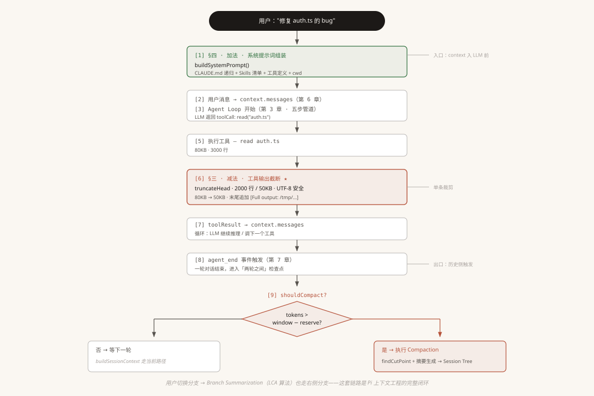
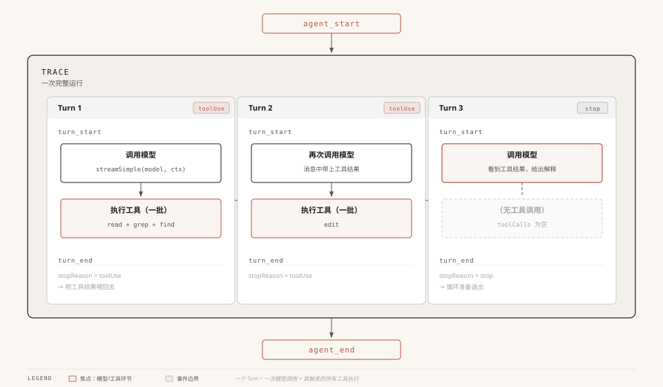
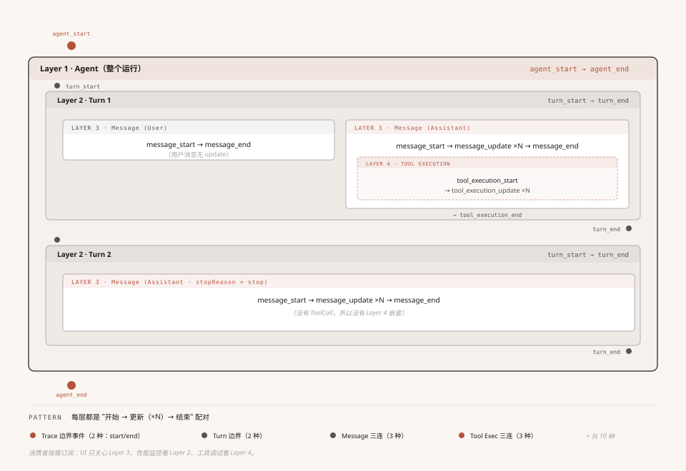
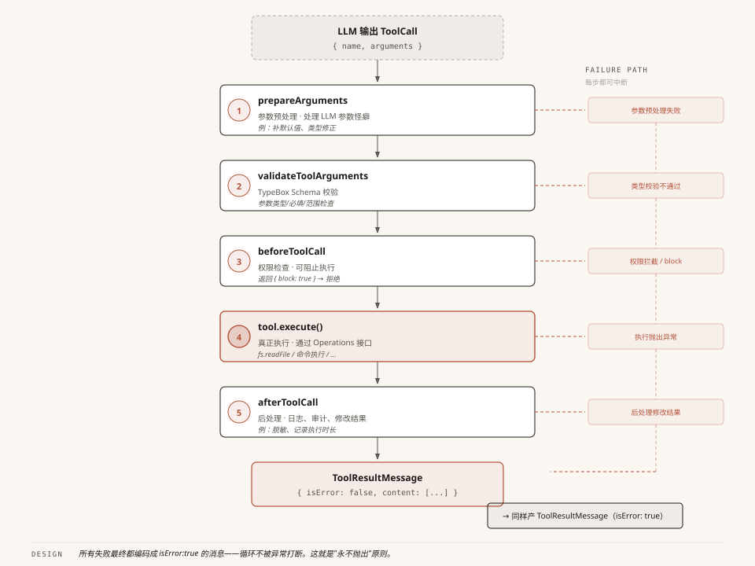
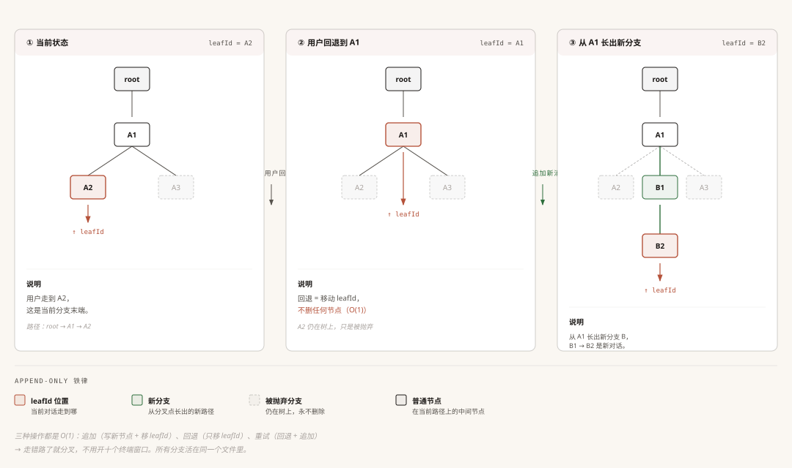
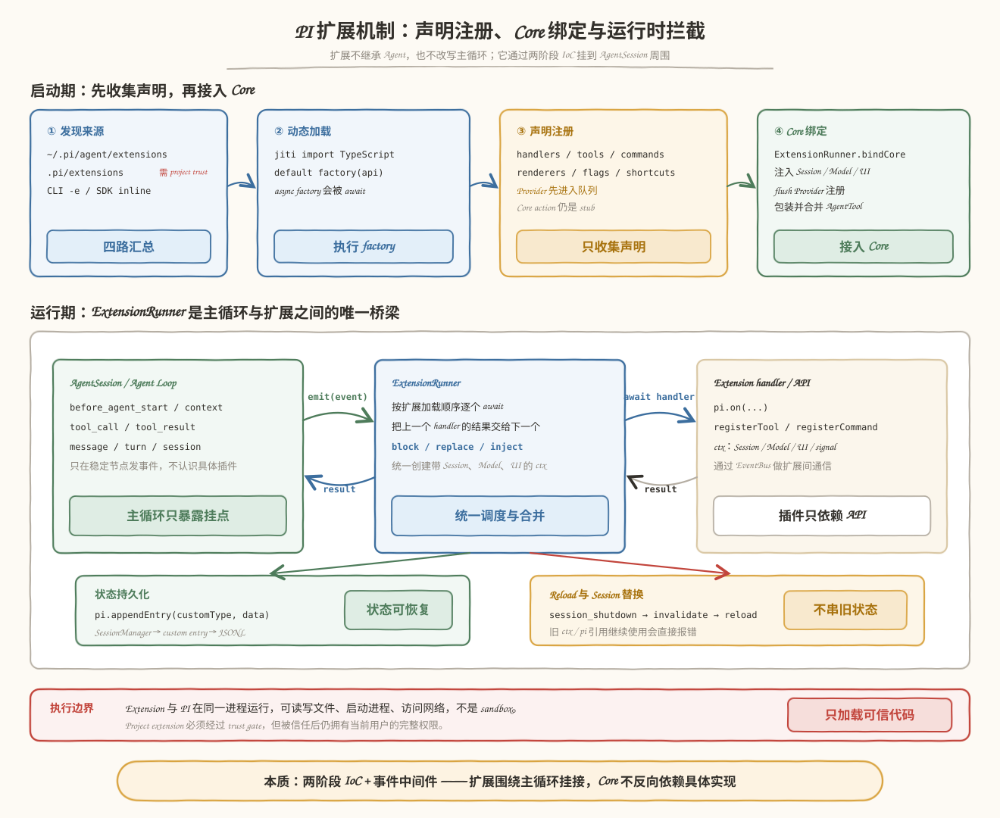

# 全流程

## Trace 和 Turn 定义

Trace: Agent一次完整运行

Turn：模型一次调用及相关的工具调用

## 事件机制：十种事件类型 - 事件观察类

PI通过**发布-订阅**模式实现了事件驱动，这也是PI扩展实现的核心之一。

## 工具调用

不能直接调用，因为LLM的输出不一定是规矩的，可能会犯这些错误：参数格式不对、类型错误、危险操作等

- 参数预处理：补默认值、类型修正
- Schema验证
- toolcall before钩子
- tool execute
- toolcall after钩子

## 上下文压缩

- **触发方式**：包括 threshold 自动触发、context overflow 恢复和 `/compact` 手动触发；自动触发条件是 `contextTokens > contextWindow - reserveTokens`
- **执行时机**：threshold 通常在一次 Agent 运行结束后的检查点执行；overflow 是例外，会中断失败或被截断的调用，压缩后最多自动重试一次
- **保留策略**：从最新消息向前累计，默认保留最近 `20k` tokens，并预留 `16,384` tokens 给下一次模型响应
- **切点约束**：优先在完整 Turn 边界切分；单个 Turn 过大时可以从 assistant message 处拆分，但不会切在 tool result，避免拆散 tool call 和对应结果
- **生成摘要**：调用 LLM 把较早消息压成结构化 summary；重复压缩时会带上 previous summary，并累计已读取、已修改的文件信息
- **写入 Session**：不删除旧节点，只在 Session Tree 末尾追加 `CompactionEntry`；之后发送给模型的是 `summary + firstKeptEntryId` 之后的近期消息
- **数据性质**：对模型上下文是有损压缩，对本地 JSONL 历史是无损保存；生成摘要本身也会消耗 token 和 cost
- **扩展入口**：`session_before_compact` 可以取消压缩或提供自定义结果，完成和失败分别触发 `session_compact`、`session_compact_failed`

## Session 会话管理

- 使用 jsonl 文件本地化管理，提供了持久化的接口，但默认未实现，纯本地化管理
- 树型结构：支持回退、分支和重试
- append-only：移动指针创建新节点，绑定到父节点上，“认父不认子”可以让追加操作不修改任务旧节点

## 扩展机制

PI 的扩展不是继承 `Agent` 或改写主循环，而是通过**两阶段绑定 + 事件中间件**，把外部能力挂到 `AgentSession` 周围。

- **发现与加载**：`ResourceLoader` 汇总全局、项目、CLI 和 SDK inline 扩展；项目扩展受 trust gate 控制；`jiti` 直接加载 TypeScript，并等待 default factory 执行完成
- **声明注册**：factory 接收 `ExtensionAPI`。`pi.on()`、`registerTool()`、`registerCommand()` 等只把声明写入当前 `Extension` 的 Map；Core action 此时仍是未绑定的 stub，Provider 注册先进入队列
- **Core 绑定**：服务和 `ExtensionRunner` 拿到真实的 Session、Model、Tool、UI 操作后，注入 runtime、flush Provider 队列，并把扩展工具包装成 `AgentTool` 合并进工具注册表
- **运行时拦截**：`AgentSession` 在 prompt、context、tool、message、turn、session 等节点发事件；`ExtensionRunner` 按加载顺序串行调用 handler，把上一个扩展的修改交给下一个，因此可以注入上下文、修改 system prompt、阻断 tool call 或改写 tool result
- **状态与 reload**：扩展用 `appendEntry()` 把自定义状态写入 Session JSONL；`/reload` 先触发 `session_shutdown`，再 invalidate 旧 runtime 并重建，避免旧 `ctx` 继续操作新 Session
- **安全边界**：Extension 与 PI 在同一进程、拥有完整系统权限，不是 sandbox，只能加载可信代码

- extension 目录：类似 Java 的 classpath，解决“去哪里找到插件”
- jiti ：类似 ClassLoader，解决“怎么加载 TypeScript 模块”
- `registerTool ()` 、` pi. on () ` ：类似 Spring 注册 Bean、Listener 或 Interceptor
- `ExtensionRunner` ：类似 Spring 容器，负责保存注册项并在合适时机调用
- ExtensionAPI  和事件  ctx ：属于 DI，PI 把扩展需要的依赖传进去

### 事件菜单 （速查）
光看图记不住全部。下面这张表按「发生在哪个环节」分类，每行标上「能做什么」，扫一遍心里有个数就行，不用背。

| 环节        | 事件                          | 对应 Agent 的什么位置                                     | 能做什么（常见场景）                 |
| --------- | --------------------------- | -------------------------------------------------- | -------------------------- |
| 会话        | `session_start`             | 会话启动 / 恢复                                          | 初始化数据、恢复用户偏好               |
|           | `session_shutdown`          | 扩展运行时被卸载（quit / reload / 切换会话）                     | 清理资源                       |
| Agent 主循环 | `before_agent_start` ⭐      | 提交问题后、开跑前                                          | 改系统提示词、注入开场消息              |
|           | `agent_start` / `agent_end` | 一轮问答的开始 / 结束                                       | 计时、收尾、通知前端                 |
|           | `agent_settled` ⭐           | 一次 `prompt()` 彻底跑完（含 retry/compaction/queue 全部处理完） | **可靠结束信号**：写库收尾、推 SSE done |
|           | `turn_start` / `turn_end`   | 每一小轮的开始 / 结束                                       | 预加载数据、每轮存档                 |
| 用户输入      | `input` ⭐                   | 收到用户输入后                                            | 敏感词过滤、快捷指令、改写输入            |
| 发给 LLM    | `context` ⭐                 | 发请求给大模型前                                           | 注入用户偏好、塞实时数据               |
|           | `before_provider_request`   | HTTP 请求体组装完、即将发出                                   | 改请求体（return 新 payload）     |
|           | `after_provider_response`   | 收到 LLM 的 HTTP 响应后                                  | 监控限流、错误告警（只读）              |
| 消息输出      | `message_start`             | 一条消息开始                                             | 消息到来的通知                    |
|           | `message_update`            | 消息流式更新（逐字）                                         | 实时渲染、打字机效果                 |
|           | `message_end`               | 一条消息结束                                             | 改最终消息、记 token 用量           |

> ⚠️ message_end 一轮会触发多次：它不是「整轮问答结束才发一次」，而是「每条 assistant 消息结束都发一次」。一次 prompt () 里 Agent 跑多轮 ReAct、调多次工具，就会触发好几次 message_end（中间那些「要调工具了」的 assistant 消息结束时也会发）。所以别拿 message_end 当整轮收尾信号——在那里写「推 SSE done」「算总 token」会重复触发好几次。整轮的可靠收尾用 agent_settled（每 prompt 只触发一次）；记 token 总量要在 agent_settled 时累加，而不是在 message_end 里各自记一笔。 | 工具 | tool_call ⭐ | 工具执行前 | 拦危险操作、改参数、权限检查 | | | tool_execution_start | 工具真正开跑 | 审计日志、显示「正在执行」 | | | tool_execution_update | 工具执行中的进度 | 展示进度片段 | | | tool_execution_end | 工具执行结束 | 算耗时、记结果 | | | tool_result ⭐ | 工具执行后 | 改返回值、敏感数据脱敏 | | 模型切换 | model_select | 切了模型 | 联动 UI、记日志 | | | thinking_level_select | 切了思考强度 | 记录、通知 | | 上下文压缩 | session_before_compact | 压缩上下文前 | 取消压缩、自定义压缩方式（用自己的摘要替代默认压缩）|

> ⭐标星的 5 个事件（before_agent_start / context / tool_call / tool_result / input）有个特殊身份——它们是那个坑的主角（只在 pi. on 派发，session. subscribe 收不到），而且是「能动手」的事件里最常用的几个（能动手的事件总共约 15 个，详见 4.5 速查表）。