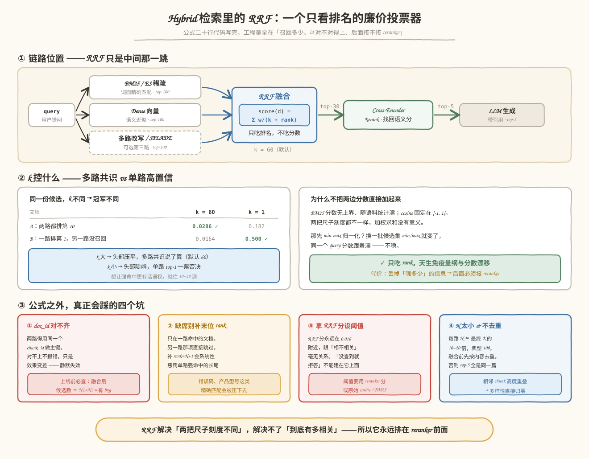
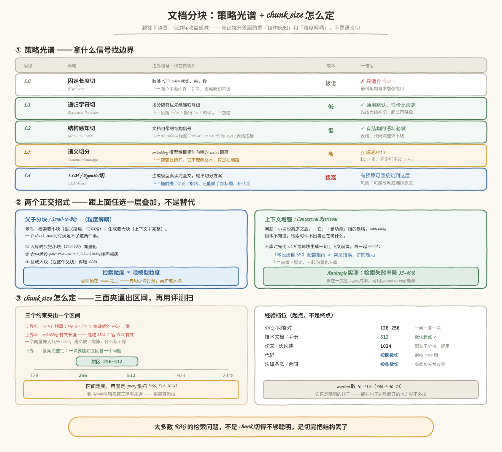

# Agent RAG 与知识系统

RAG 给模型补充外部证据。Agentic RAG 让模型参与查询改写、工具选择、多轮检索和结果验证。多一层 Agent 不会自动提高召回率。

## 复习范围

| 阶段 | 关注点 |
|---|---|
| Ingestion | 清洗、切块、元数据、版本、权限 |
| Retrieval | embedding、关键词、hybrid、filter |
| Ranking | reranker、去重、多样性 |
| Context Build | 引用、压缩、顺序、token 预算 |
| Generation | grounded answer、拒答、证据绑定 |
| Evaluation | retrieval 与 answer 分开评测 |

## 高频问题

1. RAG 和长上下文怎么选？
2. Chunk 大小如何决定？
3. 为什么 top-k 命中仍然答错？
4. Hybrid Search 和 reranker 分别解决什么？
5. Agentic RAG 比固定 Pipeline 多了什么，也多了哪些风险？
6. 如何处理权限过滤和多租户知识库？

- 讲下项目里 RAG 整体实现流程。
- 向量检索这里是不是只使用余弦相似度？余弦相似度特点是什么？还有哪些相似度算法？
- 讲一下 BM25 的计算原理
- BM25 检索结果和向量检索结果，两套数据如何做结果融合？
- 文档分块策略, chunk大小如何决定？
- Hybrid Search 和 reranker 分别解决什么？

## 指标

检索侧看 Recall@k、Precision@k、MRR、nDCG、权限过滤正确率。回答侧看正确性、证据忠实度、引用覆盖和拒答质量。端到端成功率不能替代两层诊断。

## 失败模式

- 切块破坏表格、标题和上下文关系。
- embedding 召回相似文本，但不是任务所需证据。
- reranker 改善相关性，却增加不可接受的延迟。
- 引用存在，但答案不受引用支持。
- 检索越权文档，生成阶段再过滤已经太晚。

# 要点reference

- *项目中的RAG链路*：Chunking / Threshold → Query Rewrite / Domain Gate / 条件性 HYDE → Dense + BM25 Hybrid / RRF / Rerank 的完整检索链路。
- *向量检索的方式*：
	- **余弦相似度**：忽略大小，只看方向，通过角度判断的余弦值判断其相似度。
		- **关注方向，忽略绝对大小**：它只看向量的“前进方向”是否一致，而不关心向量的“长度（模长）”。例如，在文本分析中，一篇文章和它字数翻倍后的复制版，其向量方向基本一致，余弦相似度会接近 1。
		- **取值范围明确**：-1到1。1 表示完全相同，0 表示正交（无相关性），-1 表示完全相反。
		- 适用场景：文本语义搜索（如 RAG 系统）、用户推荐（关注兴趣偏好，而非消费频次）、文档分类。
	- **欧式距离**：计算多维空间两点之间的绝对直线距离。
		- 数值越小，说明两个向量越相似（距离为 0 表示完全重合）。
		- 对向量的**绝对大小（模长）极其敏感**。如果两个用户的兴趣方向完全一样，但一个人活跃度极高（向量长），另一个人极低（向量短），欧氏距离会认为他们相距很远。
		- 适用场景：音频对比，人脸识别等严格对比绝对数值大小的场景
	- **点积(Inner Product)**: 两个向量对应位置的数值相乘再求和，也是两个向量的长度与它们夹角余弦的积。
		- 特点：同时受到**向量夹角**和**向量长度**的影响。
		- **计算极其高效**：在硬件层面（CPU/GPU）只需做乘加法，速度极快
		- **特殊情况**：如果你的向量在写入数据库前已经做了**归一化（Normalized，即模长全部转化为 1）**，那么**点积的计算结果在数学上完全等同于余弦相似度**。这也是为什么 OpenAI、HuggingFace 等模型推荐在归一化后直接使用点积（IP）来加速检索。
		- **适用场景**：大规模推荐系统（如点击率预测）、已归一化的深度学习特征向量检索。
- *BM25实现原理*：作为Sparse 稀疏检索的一种方式，通过倒排索引找出包含查询词的文档，再按“**词有多稀有、出现次数、文档长度**”计算相关性。它是改进版 TF-IDF，不理解语义，只匹配词项
- *RRF（Reciprocal Rank Fusion）双路结果融合*：`score(d) = Σ wᵢ / (k + rankᵢ(d))`，rank 从 1 起，k 默认 60。**只吃排名，不吃分数**。
	- **为什么不直接加权求和分数**：BM25 分数无上界且随语料统计漂，cosine 固定在 [-1,1]，两把尺子刻度不同；min-max 归一化又会随候选集变化而漂。RRF 只看 rank，天然免疫。代价是丢掉了「强多少」的绝对信息 —— 所以它后面**必须**接 reranker。
	- **k 控的是「多路共识」还是「单路高置信」说了算**：k=60 时，两路都排第 10（2/70=0.0286）赢过一路排第 1（1/61=0.0164）；k=1 时反过来（0.182 vs 0.5），单路 top-1 一票否决。想让强命中更有话语权就往 10~20 调。
	- **四个工程坑**：
		- **doc_id 必须对齐**到同一个 chunk_id。对不上不报错、只是效果差 —— 上线前查融合后候选数，≈ N1+N2 就说明两路完全没重叠。
		- **某路缺席就跳过那一项**，别补 `rank=N+1`，否则会系统性惩罚错误码、产品型号这类单路强命中的长尾。
		- **RRF 分数不能设阈值**：量级恒在 0.016 附近、无语义。「没查到就拒答」要用 reranker 分或原始 cosine/BM25。
		- **每路 N ≈ 最终 K 的 10~20 倍**（典型 100）；融合前先按内容去重，否则 top-5 全是同一篇的连续 chunk。
	- **现成实现**：ES 8.14+ `rrf` retriever、Milvus `RRFRanker`、Weaviate `rankedFusion`、Qdrant `fusion: rrf`、LangChain `EnsembleRetriever`；pgvector 得自己写 `row_number()` + `FULL OUTER JOIN`。

- *文档分块策略:* 用什么信号找边界——从「数 token 硬切」到「按文档结构切」到「让模型判断语义断点」，越往上越贵、边际收益越小
	- **L0 固定长度**：数够 N 个 token 就切，完全不看内容，句子表格照切不误 → 只适合 demo。
	- **L1 递归字符切**：按分隔符优先级递归降级（`\n\n` → `\n` → `。` → 空格），先按大结构切、超长再降级。**通用默认，性价比最高**。
	- **L2 结构感知切**：吃文档自带的结构 —— Markdown 标题层级 / HTML DOM / 代码 AST / 表格边框。**有结构的语料必做**，表格和代码块整体不切。
	- **L3 语义切分**：embedding 模型量相邻句向量的 cosine 距离，突变处断开。**它不理解文本，只是在测距**，断点靠一个统计阈值卡出来，换语料就得重调 → 尴尬档位：比 L1 贵，还常打不过 L1+L2。
	- **L4 LLM / Agentic 切**：生成模型真读完全文再输出切分方案，懂前提/结论/指代关系，还能顺手加标题、补代词。贵 10~100 倍，风险是可能改动或漏掉原文。
	- **L3 与 L4 的本质区别**：前者是 embedding 模型**测向量距离**，后者是生成模型**读懂内容**。一个在量距离，一个在理解 —— 别把语义切当成 LLM 切的廉价版。
	- **两个正交招式**（跟上面任选一层叠加，不是替代）：
		- **父子分块 / Small-to-Big**：检索要小块（语义聚焦、命中准），生成要大块（上下文才完整），一个 chunk_size 满足不了 → 入库只把小块向量化，命中后按 `parentDocumentId` / `chunkIndex` 找回邻居或父块再喂 LLM。核心就一句：**检索粒度 ≠ 喂模型粒度**。必须插在 **rerank 之后**，反过来的话 reranker 拿到被邻居稀释的大块，打分立刻变差。
		- **上下文增强 / Contextual Retrieval**：入库时用 LLM 给每块生成一句上下文前缀（「本段出自 X 指南 > Y 章节，讲的是…」）再一起 embed，解决小块脱离原文后「它」「该功能」指代不明的问题。Anthropic 实测配合 BM25 + rerank 能降 35~49% 检索失败率，贵在一次性 ingest 成本，可用 prompt caching 摊薄。
- *chunk 大小选择:* 三个约束夹出区间，再用评测扫，别拍脑袋
	- **上界① context 预算**：`top_k × chunk_size ≤ 给证据的 token 上限`。
	- **上界② embedding 有效长度**：模型能吃 8192 ≠ 塞 8192 有效 —— 一个向量摊到几千 token，语义被平均掉，什么都不像。`bge-m3` / `text-embedding-3` 这类**甜区在 256~512**。
	- **下界 答案完整性**：一块要能独立回答一个问题。切得比一段完整论述还小，检索到了也白搭。
	- **经验档位**：FAQ 问答对 128~256 / 技术文档手册 **512（默认起点）** / 长论述 1024 配父子分块 / 代码按函数切 / 法律条款按条款切。区间定完仍要拿固定 query 集扫 {256, 512, 1024}，看 Recall@k 和答案正确率来选。
	- **overlap 取 10~15%**（500 → 50~75）。它只是**硬切的补丁** —— 能在句子边界断开的地方就不必加；overlap 太大会让召回结果高度重复，白吃 top-k 名额。
- *dawn-ai 的分块实践*：自研 `OverlapTextSplitter implements DocumentTransformer`（没用 Spring AI 内置的 `TokenTextSplitter`），配置 `chunk-size: 500` / `chunk-overlap: 50`，配套 `similarity-threshold: 0.6`、`default-top-k: 5`（= 2500 token 证据预算）。
	- **token 是真数的**：jtokkit `CL100K_BASE` 编码，不是按字符估。
	- **标点回退找边界**：切到第 500 个 token 后往回找最后一个 `. ? ! \n`，在那儿断开。
	- **条件式 overlap（最妙的一处）**：在标点处成功回退 → `advance = consumedTokens`，**不加 overlap**；没回退说明是硬切 → `advance = consumedTokens - chunkOverlap` 才滑窗重叠。多数开源 splitter 都是无脑固定 overlap，这里把 overlap 当补丁而不是税。
	- **确定性 chunkId**：`UUID.nameUUIDFromBytes(docId + "#chunk-" + index)` → ingest 幂等（重跑是覆盖不是产生重复），且 **Dense 与 BM25 两路天然共用同一主键**，上面 RRF 那个头号坑从设计上就踩不到。
	- **已知短板**（面试讲这个比讲优点更有分量）：
		- 标点表 `List.of('.', '?', '!', '\n')` **漏了中文 `。？！；`** → 中文长段落回退不到边界，退化成硬切。
		- **没有 header-aware**：chunk 只有正文，embedding 不知道自己属于哪个产品、模块、章节。
		- **父子分块只埋了一半**：`parentDocumentId` / `chunkIndex` / `chunkCount` 都写进 metadata 了，但检索端从没读过 —— 现状是「小块检索、**小块**喂模型」。差一次 JDBC 查询（`ChunkNeighborExpander`）+ 去重排序，是当前 ROI 最高的待办。

