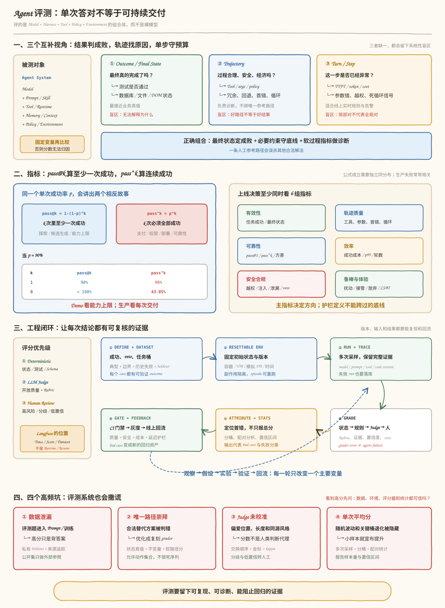

# Agent 评测与可观测性

评测判断系统是否达到目标。可观测性保留运行证据，帮助解释分数和定位首错。Trace 本身不是评测，Judge 也不是真值。

## 复习范围

| 主题 | 内容 |
|---|---|
| 评测视角 | Outcome、Trajectory、Turn / Step |
| 指标 | 成功率、`pass@k`、`pass^k`、成本、延迟、安全 |
| Dataset | 典型、边界、历史失败、holdout |
| Grader | 状态验证、规则、LLM Judge、人工 |
| Trace | run、turn、span、tool call、版本和错误 |
| 实验 | A/B、配对分析、置信区间、CI 门禁 |

## 高频问题

1. 为什么只看最终答案不够？
2. `pass@k` 和 `pass^k` 分别测什么？
3. LLM-as-a-Judge 有哪些偏差，怎么校准？
4. 如何从生产 Trace 生成回归用例？
5. Langfuse 属于 Trajectory Layer 吗？
6. 如何证明一次 Prompt 或 Skill 修改真的提升了？

## 判分顺序

```text
最终状态 / 可执行测试
→ 确定性规则与 Policy
→ LLM-as-a-Judge
→ 高风险、分歧和低置信样本交给人
```

## 失败模式

- 评测集泄漏进 Prompt 或训练数据。
- 只跑一次，随机波动被当成提升。
- 总平均掩盖核心任务桶退化。
- Judge 偏爱长答案、固定位置或同源模型。
- Grader 自己有缺陷，却把错误归给 Agent。
- 失败 run 没有落库，产生幸存者偏差。

## 项目证据

准备一次真实 A/B。至少展示样本量、任务分桶、版本、成功率、成本、p95 延迟、置信区间和代表性失败轨迹。


# Agent 评测

> [!abstract] 先记住这件事
> Agent 评测检查的是模型、Harness、工具、策略和环境共同产生的行为。
>
> - Outcome 检查任务是否完成，环境状态是否正确。
> - Trajectory 检查工具、参数、顺序、策略和恢复路径。
> - Turn / Step 检查单步质量、成本、延迟和风险。
> - System 检查数据集、环境和评分器能否支撑结论。
>
> 能写成程序的判断先交给程序。开放问题再用 LLM-as-a-Judge。高风险和判断不清的样本留给人。`pass@k` 只能说明多试几次有机会成功，不能证明生产可靠。



时间不够时，先看指标、系统设计和最后的检查清单。准备项目经历时，挑一个真实问题，讲清楚你如何建集、定位、修复和回归。

## 评测对象

### 被测的是整个 Agent 系统

Agent 的输出由多个变量共同决定：

```text
Agent Behavior
= Model
+ System Prompt / Skill
+ Context / Memory / Retrieval
+ Tool Schema / Tool Runtime
+ Orchestration / Retry / Termination
+ Permission / Policy
+ Environment State
```

公开模型榜单回答不了 "这个 Agent 能不能在我的业务里上线"。模型提供能力，Harness 决定系统如何使用这些能力。评测要把两者放在一起。

区分模型瓶颈与 Harness 瓶颈，可以做两类实验：

- Model swap 固定 Harness，只换模型。分数随模型明显变化时，瓶颈更可能在模型。
- Ablation 固定模型，关闭或替换一个 Harness 组件。它适合检查工具、记忆、提示词和策略是否真的有用。

### 三种检查粒度

| 视角 | 问题 | 常用方法 | 盲区 |
|---|---|---|---|
| Outcome / Final state | 最终真的完成了吗？ | 单元测试、数据库状态、文件/DOM/API 验证 | 不能解释为什么成功或失败 |
| Trajectory | 过程是否正确、经济、安全？ | 工具/参数/顺序检查、路径效率、首错归因 | 不应强制唯一参考路径 |
| Turn / Step | 这一步是否异常？ | 实时规则、轻量分类器、span 指标 | 局部合理不代表全局成功 |

Per-turn 更像在线监控和过程评分的粒度。它不是一套公认的学术分层，面试时别说得太满。

### Outcome 和 Trajectory 要一起看

- 只看 Outcome：可能放过越权、绕路、偶然成功和 reward hacking。
- 只看 Trajectory：可能误杀合法替代路径；Agent 不必复刻人工参考步骤。
- 最终状态判断任务是否完成。
- 必要约束守住流程和安全底线。
- 步数、回退和冗余调用通常用于诊断，不要轻易设成一票否决。

## 指标

### 先按用途分

| 维度 | 主指标 | 典型诊断指标 |
|---|---|---|
| 有效性 | Task Success Rate、状态正确率 | 子目标完成率、事实正确率 |
| 轨迹质量 | 合法动作率、工具/参数正确率 | 冗余调用、回退、循环、首错步骤 |
| 可靠性 | `pass@1`、`pass^k`、方差 | 随机种子敏感性、重复运行一致性 |
| 效率 | 成功任务成本、端到端延迟 | 轮数、token、工具次数、TTFT、p95 |
| 安全合规 | policy violation、越权率 | 注入成功率、敏感数据泄露、未确认写操作 |
| 鲁棒性 | 扰动后成功率 | API 抖动、页面变化、长上下文、歧义输入 |
| 用户体验 | CSAT、任务放弃率 | 澄清次数、人工接管率、首响时间 |

只报平均成本会藏住失败重试和长尾任务。至少补上：
>
> - `cost_per_success = 总成本 / 成功任务数`
> - 延迟看 `p50 / p95 / p99`
> - 质量、成本、延迟放在同一份报告里

### `pass@k` 看能力上限

同一任务尝试 $k$ 次，至少一次成功即通过：

$$
\mathrm{pass@k}=1-(1-p)^k
$$

上式假设每次尝试独立，且单次成功率都是 $p$。它适合：

- 搜索、漏洞发现、开放式探索；
- 可以生成多个候选，再由人或验证器挑选的任务；
- 回答 "给足预算，系统是否有机会做成"。

如果从同一任务生成了 $n$ 个样本，其中 $c$ 个成功，代码生成评测常用无偏估计：

$$
\widehat{\mathrm{pass@k}}
=1-\frac{\binom{n-c}{k}}{\binom{n}{k}}
$$

### `pass^k` 看重复稳定性

同一任务连续运行 $k$ 次，要求全部成功：

$$
\mathrm{pass}^{k}=p^k
$$

若单次成功率 $p=0.9$：

| k | `pass@k` | `pass^k` |
|---:|---:|---:|
| 1 | 90% | 90% |
| 4 | 99.99% | 65.61% |
| 8 | 约 100% | 43.05% |

Demo 只需挑出一次成功。生产会把每次失败都算进去。这就是两个指标看起来差得很远的原因。

若同一任务实际运行 $n$ 次，其中 $c$ 次成功，任务级经验估计为：

$$
\widehat{\mathrm{pass}^{k}}
=\frac{\binom{c}{k}}{\binom{n}{k}},\qquad n\ge k
$$

τ-bench 也先按任务计算 `pass^k`，再对任务聚合。这里的 $k$ 和 turn 数无关，也不表示从多次尝试中挑最好的一条。

### `pass^k` 容易算错，也容易讲错

1. `p^k` 依赖 IID 假设。共享服务故障、脏状态和同一个 prompt 缺陷会让失败相关，不能机械乘方。
2. 不要混淆两个实验：
   - 同一任务重复 $k$ 次：测重复稳定性；
   - 连续 $k$ 个不同生产任务：测业务流水线可靠性。
3. 扣款、发信和删数据不能直接重复。要在可重置沙盒中运行，或使用幂等键。
4. 报告 `pass^k` 时，同时给出 `pass@1`、样本量、置信区间、任务桶和失败相关性。

### 护栏和一票否决

主指标提升不代表应该上线。常见护栏：

- 安全违规不得增加；
- 核心任务桶不得退化；
- p95 延迟、成本、人工接管率不能越过阈值；
- 幻觉、越权、未确认高风险操作可设为 veto。

先定义业务目标，再写不能变差的护栏。Prompt 长度、工具次数这类机制指标只能解释变化，不能代替业务结果。

## Benchmark

| Benchmark | 任务形态 | 主要验证方式 | 面试时强调的边界 |
|---|---|---|---|
| [GAIA](https://arxiv.org/abs/2311.12983) | 多步推理、搜索、文件与多模态 | 简短答案匹配 | 适合测通用工具协作；公开题存在污染风险 |
| [BFCL](https://gorilla.cs.berkeley.edu/blogs/13_bfcl_v3_multi_turn.html) | Function / Tool Calling | 函数、参数、执行结果与 API 状态 | 偏工具调用协议，不等于端到端业务 Agent |
| [SWE-bench Verified](https://github.com/SWE-bench/SWE-bench) | 修复真实 GitHub issue | `FAIL_TO_PASS` + `PASS_TO_PASS` 测试 | 受环境、测试覆盖、Harness 与数据污染影响 |
| [SWE-bench Pro](https://github.com/scaleapi/SWE-bench_Pro-os) | 更长程、多仓库与多语言软件任务 | 容器内测试验证 patch | 更接近工程但运行昂贵；公开历史代码仍可能泄漏修复 |
| [WebArena](https://arxiv.org/abs/2307.13854) | 可复现网站上的网页任务 | URL、HTML 与程序化页面状态 | 沙盒可复现，但与真实网站分布仍有差距 |
| [OSWorld](https://os-world.github.io/) | 桌面应用跨应用操作 | OS / 应用状态验证函数 | 环境复杂，初始化和 evaluator 可靠性本身是难点 |
| [τ-bench](https://arxiv.org/abs/2406.12045) / [τ²-bench](https://arxiv.org/abs/2506.07982) | 多轮客服、用户模拟、工具和 policy | 最终数据库状态 + 对话/流程约束 | 用户模拟器与 policy grader 也必须被校准 |
| [Terminal-Bench](https://www.tbench.ai/) | 真实感命令行任务 | 容器内脚本、文件与程序行为 | 靠近工程环境；镜像、网络、资源上限和污染需治理 |
| 多 Agent 协作集 | 委派、通信、协作完成任务 | 组件 + 交互 + E2E 自建 Rubric | 尚无覆盖所有协作范式的统一金标准 |

### 面试时怎么介绍一个 Benchmark

别背排行榜。说清四件事就够了：

1. Agent 在哪里操作？
2. 输入和目标是什么？
3. 最终状态怎么验证？
4. 它漏掉了哪些生产因素？

### 公开高分不能直接拿来做上线决定

- 数据污染：公开任务可能进入训练或提示工程；
- evaluator 漏洞：测试过松、状态未真正检查；
- 环境差异：沙盒 API、页面和真实生产不同；
- 任务分布不同：公开平均分未覆盖你的关键长尾；
- 预算不同：Benchmark 给足步数和 token，生产有成本/时延上限；
- 风险不同：公开评测失败只是 0 分，生产失败可能产生真实副作用。

公开 Benchmark 适合找能力边界。上线决定还是要看自己的任务和失败成本。

## LLM-as-a-Judge

### 先确认是否真的需要 Judge

评分优先级：

```text
可执行真值 / 最终状态
    > 确定性规则与 Schema
    > LLM-as-a-Judge
    > 人工处理高风险、低置信度和分歧样本
```

适合 Judge 的内容：

- 开放式报告是否覆盖关键点；
- 回答是否忠于证据、清晰、合规；
- 两个方案哪个更好，以及差异出现在哪个维度。

不该交给 Judge 的内容：

- 文件是否生成、测试是否通过；
- 数据库最终状态、金额和权限是否正确；
- JSON 是否符合 Schema；
- 工具参数是否违反确定性 policy。

### 已知偏差

| 偏差 | 表现 | 缓解 |
|---|---|---|
| Position bias | 偏爱 A/B 中固定位置 | 交换顺序复评；矛盾则打平或转人工 |
| Verbosity bias | 更长的答案更易得高分 | Rubric 惩罚无关冗长；审计分数与长度相关性 |
| Self-preference | 偏爱同模型家族的风格 | 异构 Judge、人工金标校准 |
| Style / authority bias | 被流畅、自信或术语掩盖 | 要求逐维度引用可观察证据 |

### 落地方式

1. 先写 Rubric。每一维都要有可观察的 1–4 档或 pass/fail 标准。
2. 分开必要项、加分项和 veto。安全错误不能被平均分冲淡。
3. 去掉候选中的模型名、版本号和其他身份线索。
4. 比较模型和 Prompt 时优先做 pairwise。绝对分很容易跨批次漂移。
5. 交换 A/B 顺序再评一次。结果随位置变化的样本应标记为不确定。
6. Judge 要引用输出或轨迹中的证据，再给 verdict。不需要它暴露隐藏 Chain-of-Thought。
7. 用人工金标检查一致率或 Cohen's kappa。Judge 或 Rubric 改版后重做校准。

### Judge 输出

```json
{
  "rubric_version": "refund-v3",
  "dimensions": [
    {
      "name": "policy_compliance",
      "score": 4,
      "evidence": ["tool_call#3 先检查退款期限", "final state 为 refunded"],
      "confidence": 0.94
    }
  ],
  "vetoes": [],
  "verdict": "pass",
  "needs_human_review": false
}
```

> [!warning] 这些做法会让分数失去意义
> - Judge 直接给一个总分，没有证据；
> - Rubric 写成 "回答是否优秀"；
> - Agent 和 Judge 同源，却从不做人类校准；
> - 用多数投票掩盖所有 Judge 共享的系统偏差；
> - 把 Judge 结论当真值，而不保留原始轨迹供复核。

## 数据集

### 一个 Eval Case 要留下什么

```yaml
id: refund-expired-order
input: 用户请求与已知上下文
initial_state: 可重置的订单、账户与时间
environment_version: refund-sim@sha256:...
agent_config:
  model: pinned-model-id
  prompt_version: v17
  toolset_version: v5
constraints:
  required: [查询订单, 检查政策, 获得确认]
  forbidden: [越权退款, 编造审批记录]
expected_outcome:
  state_assertions: [...]
  response_requirements: [...]
graders: [state_grader, policy_grader, response_judge]
tags: [refund, policy, adversarial, level-2]
```

### Golden Set 怎么分

| 桶 | 作用 |
|---|---|
| 典型流量 | 保证主路径真实代表业务 |
| 边界 / 对抗 | 歧义、注入、权限、异常、超时 |
| 历史失败回归 | 修过的问题不能复发 |
| Holdout | 从未进入 prompt、few-shot、训练和调参过程 |

此外必须记录任务类型、难度、风险、语言、工具链等标签，避免总平均掩盖关键桶退化。

### 两种回归任务

端到端回归：

- 从初始状态跑到结束；
- 验证真实任务是否完成；
- 最接近业务，但贵且难定位首错。

Trajectory-prefix 回归：

- 冻结到历史失败前的上下文与环境状态；
- 只评下一步或下几步动作；
- 适合快速验证工具选择、澄清、权限判断和恢复策略。

Trajectory-prefix 的答案应列出可接受动作和禁止动作，不要只给一条参考轨迹。

### 防污染

- 数据集、Prompt、Skill、训练数据之间做来源追踪；
- 公开集只做外部参照，自建私有集做决策；
- 参数化生成任务，但保留人工审查；
- 定期加入生产新失败，旧失败进入回归集；
- 对 evaluator 做反向测试：准备表面正确、实际错误的诱骗样本；
- Dataset、环境、Rubric、模型和代码全部版本化。

## 设计一套 Agent Eval Pipeline

我会按系统真正运行的顺序答这类题。这样不容易漏掉 reset、版本和失败样本。

### 1. 定义成功和失败成本

先问：

- 最终可验证状态是什么？
- 哪些错误是 veto？
- 谁定义 Rubric，业务 owner 还是算法团队？
- 失败可否重试，是否有真实副作用？

### 2. 建立可重置环境

- 固定时间、数据快照、工具版本和依赖；
- 容器 / VM / 模拟数据库隔离副作用；
- 每个 episode 前 reset，结束后校验残留；
- 外部 API 尽量录制回放，或显式记录不可控变量。

### 3. 构建分桶数据集

真实流量 + 边界对抗 + 历史失败 + holdout，并给每个 case 定义初始状态、预期结果、约束和 grader。

### 4. 执行和限流

- 每配置多次采样；
- A/B 交替执行，降低时段负载偏差；
- 控制 RPM/TPM、超时和总预算；
- mutating task 使用独立沙盒，避免交叉污染。

### 5. 按证据强度评分

1. 状态 / 测试 / Schema 等确定性验证；
2. 安全、policy 和过程不变量；
3. LLM Judge 处理开放式质量；
4. 高风险、分歧、低置信度样本进人工队列。

### 6. 记录证据

```text
Run / Trace
  ├─ case_id, experiment_id, input_hash
  ├─ model / prompt / toolset / code / environment version
  ├─ final outcome, scores, vetoes
  └─ Turn / Span
       ├─ LLM: latency, TTFT, token, stop_reason
       ├─ Tool: name, normalized args, start/end, result/error
       └─ Policy: allow/deny/confirm + rule version
```

敏感输入、工具参数和输出默认脱敏；不要采集模型隐藏思维链。

### 7. 做统计，找首错

- 报样本量、均值、分位数和置信区间；
- 同一批 case 对比配置时用配对分析；
- 二元结果可用 McNemar 或配对 bootstrap；
- 找首个导致偏离的错误，不要把最后的报错当根因；
- 输出各失败类型的数量、影响和代表轨迹。

推荐初始 taxonomy：

```text
任务理解 → 规划 → 工具选择 → 参数 → 工具/环境故障
→ 状态观察 → policy/安全 → 循环/终止 → 最终表达 → grader 缺陷
```

### 8. 接入 CI 和线上回流

```text
代码 / Prompt / Skill / 模型变化
              ↓
快速集 → 回归集 → 全量 / 高风险集
              ↓
质量门槛 + 护栏 + 统计置信度
              ↓
灰度 / 影子流量 → 线上监控 → bad case 回流
```

门禁不要只写 "总分不能下降"：

- 核心桶零回归；
- veto 必须为 0；
- p95 延迟和成功任务成本不过线；
- Judge 与人工一致率未过门槛时，不允许自动拦截发布。

## Trajectory 和可观测性

### 工程组件

| 层面 | 工程能力 |
|---|---|
| 数据模型 | trace/run/turn/span/tool_call、父子关系、时序、错误类型、版本 |
| 上下文传播 | OpenTelemetry Context、`AsyncLocalStorage` / `ContextVar` |
| 采集传输 | SDK hook、异步 batch、背压、重试、幂等去重 |
| 存储查询 | 元数据存储、OLAP、对象存储；按 case/version/error 建索引 |
| 分析 | 路径、延迟、成本、工具错误、首错与异常聚类 |
| 安全 | 脱敏、RBAC、租户隔离、保留策略、审计 |
| 回归资产化 | 从 trace 提取 E2E case 和 trajectory-prefix case |

### Langfuse 属于这一层吗

属于。它主要覆盖轨迹观测、查询、评分、Dataset 和 Experiment，不负责 Agent Runtime。

```text
Agent Runtime / Workflow
  └─ 产生结构化 Trace
       ├─ Langfuse / LangSmith / Phoenix：观察、调试、评分、分析
       ├─ Eval Harness / Braintrust 等：数据集、实验与回归工作流
       └─ Runtime 自身：授权、调度、checkpoint、resume、幂等与副作用
```

| 类别 | 代表 | 解决什么 | 不解决什么 |
|---|---|---|---|
| Telemetry 标准 | OpenTelemetry / OpenInference | span 模型、上下文传播、采集与后端解耦 | 不定义业务成功 |
| 观测与评测平台 | Langfuse / LangSmith / Phoenix | Trace UI、Score、Dataset、实验和线上分析 | 不替代可重置 Benchmark 环境 |
| 实验工作流 | Braintrust 等 | Dataset、Scorer、Experiment、CI 比较 | 不负责 Agent 权限与副作用 |
| Agent Runtime | LangGraph / Temporal / 自研 Harness | 调度、状态、checkpoint、resume、重试 | 不自动产生可信 Rubric 与 Golden Set |

只报一个平台名没有信息量。说清这些实现细节：

- 采集哪些事件；
- 如何关联版本与 case；
- 如何脱敏；
- 如何从 trace 找首错；
- 如何把生产 bad case 转成回归测试；
- 平台故障时为何不能影响 Agent 主链路。

深入记录字段与 A/B 对比方法见 [[04-Agent-工程化评测]]。

## 控制评测成本和延迟

### 离线

- PR：小型 deterministic smoke set；
- 主分支：目标集 + 历史回归；
- 夜间：全量、多种子、多 Judge、对抗集；
- 发布前：高风险场景与真实环境复测。

### 在线

- 全量：便宜的规则、状态检查、成本/延迟和 policy 指标；
- 抽样：轻量 Judge 或分类器；
- 小比例：强 Judge、多评委；
- 人工：高风险、低置信度、Judge 分歧与用户投诉。

### 省预算

- 相同 case 复用不可变输入和环境快照；
- 先跑确定性 grader，失败后无需调用昂贵 Judge；
- 对重复近似轨迹去重采样；
- 先用快速集筛方案，再对候选跑全量；
- 分桶做 power analysis，把预算投向结论不确定的桶；
- 缓存 Judge 结果时必须绑定 Judge、Rubric 与输入哈希。

## 代码题

### `pass@k` 和 `pass^k`

```python
from collections.abc import Sequence


def pass_at_k(results: Sequence[bool], k: int) -> bool:
    if not 1 <= k <= len(results):
        raise ValueError("k must be within the number of runs")
    return any(results[:k])


def pass_pow_k(results: Sequence[bool], k: int) -> bool:
    if not 1 <= k <= len(results):
        raise ValueError("k must be within the number of runs")
    return all(results[:k])
```

追问点：

- 输入为空、`k` 越界怎么处理；
- 这是单任务判定，跨任务还要取平均；
- 是否保证同一 case、同一配置；
- 副作用环境是否 reset；
- 运行失败通常也算不通过，不能静默丢弃。

### 简易 Eval Harness

```python
async def evaluate_case(case, agent, graders):
    sandbox = await case.environment.reset()
    trace = await agent.run(
        case.input,
        environment=sandbox,
        timeout=case.timeout,
    )

    scores = []
    for grader in graders:
        scores.append(await grader.score(case=case, trace=trace, env=sandbox))

    return aggregate_with_veto(scores)
```

追问点：

- 并发限速、超时与取消；
- case 隔离和 deterministic reset；
- Agent 失败后仍要保留 trace；
- grader 异常不能伪装成 Agent 失败；
- 每个结果绑定完整版本；
- 结果写入要幂等，避免重试产生重复 run。

### 轨迹比对

严格比较工具序列会惩罚合法替代路径。更合理的是：

1. 检查必要状态是否达成；
2. 检查 forbidden action 是否出现；
3. 检查关键事件的偏序关系，如 "确认" 必须发生在 "扣款" 前；
4. 冗余调用与步数作为软分；
5. 失败时定位首个违反不变量的步骤。

## 行为面试

### 从 "感觉变差" 到可复现回归

- S：线上某类任务成功率下降，但日志只有最终错误。
- T：建立可定位、可回归的评测闭环。
- A：
  - 补齐 trace / turn / tool schema；
  - 从投诉和失败轨迹构建分桶 Golden Set；
  - 用状态 grader + Judge；
  - 首错归因后修复工具描述或编排；
  - 接入 CI。
- R：用真实数字说明成功率、人工接管、成本、定位耗时变化。也要说清仍未覆盖的边界。

### 评测结论与业务反馈冲突

回答重点：

1. 先检查指标是否代理错了目标；
2. 比较线上流量与 Eval Set 分布；
3. 抽查 grader / Judge 是否偏置；
4. 检查环境、工具和版本是否一致；
5. 把冲突样本建成新任务桶，不要争论哪一方 "更真实"。

### 面试追问

为什么选这个指标？

> 它直接对应业务可验证状态。过程指标用于诊断，成本和安全是护栏。

如何说服团队采纳评测结论？

> 展示版本可复现的配对结果、代表性轨迹、置信区间和失败桶，而不是只给一个平均分。

你踩过什么坑？

> 讲一个具体机制：数据泄漏、Judge 长度偏差、环境未 reset、失败样本被过滤、总分掩盖关键桶退化。

## 容易减分的回答

1. 只报最终准确率，不提环境状态和过程诊断。
2. 只背 Benchmark 名字，讲不出怎么验证。
3. 把 `pass@k` 当稳定性，把多试几次当生产可靠。
4. 说 "用 LLM Judge"，但没有 Rubric、校准和人工审计。
5. 强制匹配唯一参考轨迹，误杀合法替代路径。
6. 单次 A/B 就宣布提升，不报样本量和波动。
7. 只测目标 case，没有回归集与 holdout。
8. 把高风险 policy 写在 Prompt，而不是确定性编排层。
9. 记录原始 prompt、secret、header，却没有脱敏和权限治理。
10. 只说 Langfuse / LangSmith 工具名，不说事件模型和反馈闭环。
11. Agent 失败的 run 被代码异常过滤，造成 survivorship bias。
12. 忽略 grader 自己也可能出错，把 evaluator defect 归因给 Agent。

## 临场检查

- [ ] 能用 30 秒讲清 Outcome / Trajectory / Turn 三个视角
- [ ] 能写出 `pass@k = 1-(1-p)^k` 与 `pass^k = p^k`
- [ ] 能解释 `p^k` 的 IID 前提和副作用任务如何复测
- [ ] 能按 "环境、任务、验证、边界" 介绍至少 5 个 Benchmark
- [ ] 能讲出 Judge 的 position / verbosity / self-preference 偏差
- [ ] 能说明为什么 deterministic grader 优先于 LLM Judge
- [ ] 能口头画出数据集 → 环境 → 执行 → 评分 → 归因 → CI → 线上回流
- [ ] 能说明 Langfuse 属于观测与评测平台，而不是 Agent Runtime
- [ ] 准备了 2 个带数据、反思和边界的 STAR 案例
- [ ] 记得主动问：成功标准、失败成本、是否有副作用、谁定义 Rubric

## 相关

- [[04-Agent-工程化评测]]
- [[01-性能工程与-benchmark]]
- [[02-Agent-运行机制]]
- [《Agent 的评估》](../ai-agent-book/chapter6.md)

## 参考资料

- [HumanEval：pass@k 估计量](https://arxiv.org/abs/2107.03374)
- [τ-bench 论文](https://arxiv.org/abs/2406.12045) · [官方实现](https://github.com/sierra-research/tau-bench)
- [τ²-bench 论文](https://arxiv.org/abs/2506.07982)
- [SWE-bench](https://github.com/SWE-bench/SWE-bench) · [SWE-bench Verified 说明](https://openai.com/index/introducing-swe-bench-verified/)
- [WebArena](https://arxiv.org/abs/2307.13854) · [OSWorld](https://arxiv.org/abs/2404.07972)
- [BFCL V3](https://gorilla.cs.berkeley.edu/blogs/13_bfcl_v3_multi_turn.html)
- [MT-Bench：LLM-as-a-Judge](https://arxiv.org/abs/2306.05685)
- [Judging the Judges：Position Bias](https://arxiv.org/abs/2406.07791)
- [OpenTelemetry Traces](https://opentelemetry.io/docs/concepts/signals/traces/)
- [Langfuse Evaluation](https://langfuse.com/docs/evaluation/overview)

