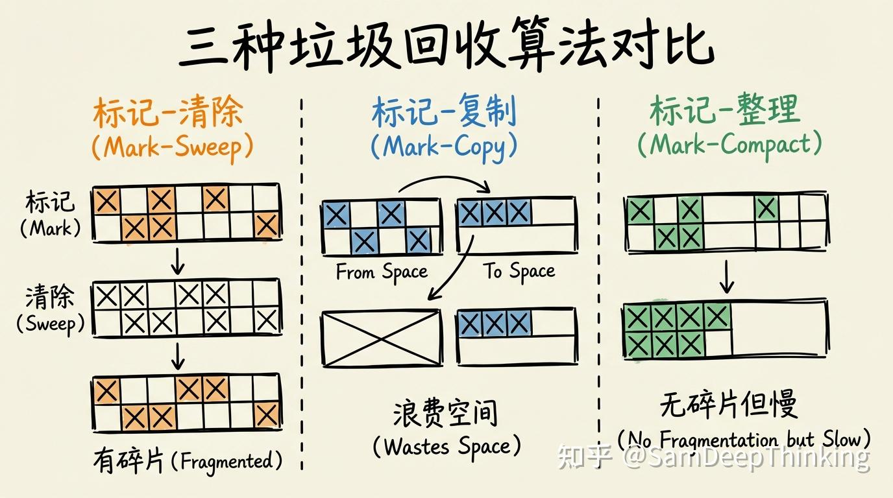
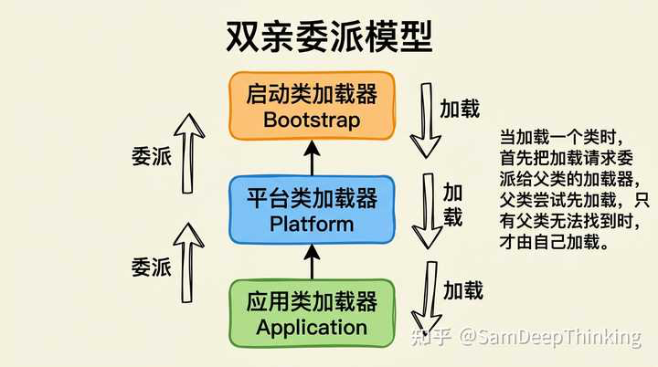
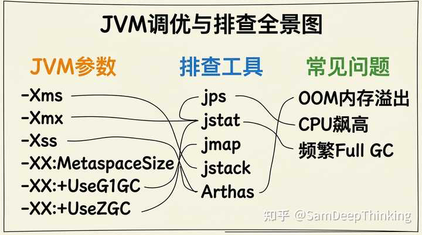

# JVM 高频主线

> 这篇只保留四条主线：运行时数据区、GC、类加载、调优排障。  
> 并发里的 JMM 统一放到 [JMM 与 volatile](../02-JUC并发/JMM与volatile.md)。

- reference: 

## 先分清两个“内存模型”

- **JVM 运行时数据区**：回答“对象、类元数据、栈帧分别放哪”。
- **JMM（Java Memory Model）**：回答“多线程如何看见共享变量”。

面试里一上来先分清这两个概念，后面就不容易串题。

## 1. 运行时数据区

```text
JVM 进程
├── 线程共享
│   ├── 堆（Heap）
│   ├── 方法区（HotSpot 里主要是 Metaspace）
│   └── 运行时常量池
└── 线程私有
    ├── 程序计数器
    ├── Java 虚拟机栈
    └── 本地方法栈
```


| 区域 | 线程归属 | 主要内容 | 高频追问 |
| --- | --- | --- | --- |
| 堆 | 共享 | 对象实例、数组 | `new` 出来的对象都去哪 |
| 方法区 / Metaspace | 共享 | 类元数据、常量、静态变量 | JDK 8 后永久代去哪了 |
| 虚拟机栈 | 私有 | 栈帧、局部变量表、操作数栈 | `StackOverflowError` vs OOM |
| 程序计数器 | 私有 | 当前线程下一条字节码位置 | 为什么它几乎不报 OOM |
| 本地方法栈 | 私有 | Native 方法调用信息 | 和虚拟机栈的区别 |

### 30 秒口述

对象主要在堆里，类元数据在方法区 / Metaspace，方法调用过程在栈里。线程切换靠程序计数器记住下一条要执行的字节码。面试里只要先把“共享区域”和“私有区域”分清，再补充 `StackOverflowError`、Metaspace 和堆 OOM 的差异，主线就稳了。

### 常见追问 / 坑

- **JDK 8 后没有 PermGen 了**，HotSpot 用的是 **Metaspace**，走本地内存。
- 栈溢出通常是递归太深 / 调用链太深；堆 OOM 通常是对象太多或泄漏。
- “方法区”是 JVM 规范概念，“Metaspace”是 HotSpot 实现。

## 2. GC 主线

### 先记三件事

1. **怎么判断对象该回收**：可达性分析，不是简单“引用计数”。
2. **为什么常按代回收**：大多数对象朝生夕死，少数对象活得久。
3. **收集器怎么选**：本质是在吞吐、停顿、内存占用之间取舍。

### 垃圾回收器速记

| 回收器    | 关键词          | 适用场景              |
| ------ | ------------ | ----------------- |
| Serial | 单线程、简单       | 小内存、低复杂度场景        |
| CMS    | 低停顿、已淘汰      | 只需知道思路，JDK 14 已移除 |
| G1     | Region、可预测停顿 | JDK 9+ 默认，通用服务首选  |
| ZGC    | 超低停顿、读屏障     | 大堆、极度关注延迟的服务      |

### 30 秒口述

GC 先通过可达性分析判断对象是否存活，再按分代假说处理：新生代对象大多短命，常见算法是复制；老年代对象存活久，更关注整理碎片和停顿控制。现代服务里默认先看 G1，只有在超大堆、超低延迟场景才重点考虑 ZGC。

### 常见追问 / 坑

- 频繁 Full GC 不要只会“加堆”，先看对象存活率、分配速率、缓存策略。
- G1 追求的是**可预测停顿**，不是绝对最高吞吐。
- ZGC 的卖点是低延迟，不是没有成本；它通常需要更多内存空间换停顿时间。

## 3. 类加载与双亲委派

Java 17 常见三层类加载器：
- 启动类加载器（Bootstrap ClassLoader）
- 平台类加载器（Platform ClassLoader）
- 应用类加载器（Application ClassLoader）



### 30 秒口述

一个类从 `加载 -> 连接 -> 初始化` 进入 JVM。双亲委派的核心是：收到加载请求时，先交给父加载器尝试，父亲找不到再自己加载。它解决两件事：一是防止核心类库被篡改，二是避免类被重复加载。

### 特例与追问

- **SPI** 会出现“父类加载器加载接口、子类加载器加载实现”的反向委派。
- 热部署 / 模块隔离常依赖自定义类加载器。
- 面试如果追问 `Class.forName()` 和 `ClassLoader.loadClass()`，重点答“是否触发初始化”。

## 4. 调优与排障

- [为什么那么多带gc的语言,只有jvm需要调优?](https://www.zhihu.com/question/602234735/answer/2066500567258731942)



### 方法论

1. 先确定是 **CPU、内存、停顿、死锁** 哪一类现象。
2. 再用线程栈、GC 指标、堆快照定位到具体对象或线程。
3. 最后回到代码和流量特征，别只在 JVM 参数上兜圈子。

### 高频场景 1：CPU 飙高

定位套路：
1. 先找最耗 CPU 的 Java 进程。
2. 再找进程内最耗 CPU 的线程。
3. 把线程 ID 转成十六进制。
4. 用 `jstack` 对应到线程栈，看它到底卡在业务代码、锁竞争，还是 GC。

如果最忙的是 GC 线程，基本就转入“为什么回收这么频繁”的问题。

### 高频场景 2：OOM / Full GC 压不下

核心判断：
- 老年代占用只涨不降
- Full GC 越来越频繁
- 服务吞吐和 RT 同时恶化

定位套路：
1. 先保留 GC 日志和监控曲线
2. 导出堆快照，优先看大对象、长生命周期集合、缓存命中策略:
	- 依靠预设值的 JVM 参数 `-XX:+HeapDumpOnOutOfMemoryError`，在 OOM 时自动生成 dump
	- 在内存高位手动 dump: `jmap - dump:format=b, file=heap.hprof 9527`
3. 使用MAT打开heap.hprof 分析：再看对象到 GC Roots 的引用链，确认是谁把它们留住了
	- 看Leak Suspects报告
	- 看Dominator Tree，找出内存占用最大的对象
	- 对可疑对象右键，path to GC Roots，看它被谁一直引用

常见元凶：
- 静态 `Map/List` 只加不删
- 缓存没有淘汰策略
- 连接、流、监听器没有及时释放

### 高频场景 3：死锁

表现通常是：功能卡死，但 CPU 不高。  
这时直接看线程栈，`jstack` 往往会明确告诉你哪几个线程互相持锁等待。

## 5. 常用命令

| 命令 | 看什么 | 常用法 |
| --- | --- | --- |
| `jps` | 当前 Java 进程 | `jps -lv` |
| `jstat` | GC 与容量采样 | `jstat -gcutil <pid> 1000 10` |
| `jcmd` | 综合诊断入口 | `jcmd <pid> GC.heap_info` |
| `jstack` | 线程栈、锁、死锁 | `jstack -l <pid> > threads.txt` |
| `jmap` | 对象统计、Heap Dump | `jmap -histo:live <pid>` |
| `jfr` / `JFR` | 持续采样与事件记录 | `jcmd <pid> JFR.start settings=profile duration=60s filename=app.jfr` |

补充：
- `jfr summary app.jfr`：快速看记录概览
- `jfr print --events jdk.CPULoad,jdk.GarbageCollection app.jfr`：按事件打印

## 面试 Checklist

- 能先区分 JVM 运行时数据区和 JMM。
- 能说清堆、栈、方法区 / Metaspace 分别放什么。
- 能解释为什么现代服务默认先看 G1，再按低延迟需求考虑 ZGC。
- 能讲清双亲委派为什么既保证安全又避免重复加载。
- 能给出 CPU 飙高、OOM、死锁三类问题的基本排查顺序。
