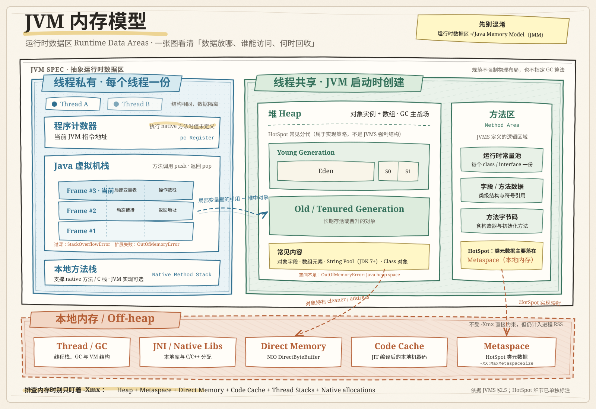

# JVM 内存模型

通常指 JVM 运行时数据区，与 JMM（Java 内存模型）不同。

- JVM 内存模型（JVM 运行时数据区）：关注 JVM 运行时把内存划分成哪些区域。
- Java 内存模型（**Java Memory Model，JMM**）：描述多线程如何读写共享变量，以及可见性、有序性和原子性规则。

```
JVM 进程
├── 线程共享
│   ├── 堆（Heap）
│   ├── 方法区（Method Area）
│   │   └── HotSpot 中主要由 Metaspace 实现
│   └── 运行时常量池（Runtime Constant Pool）
│
└── 线程私有
    ├── 程序计数器（Program Counter Register）
    ├── Java 虚拟机栈（JVM Stack）
    │   └── 栈帧（Stack Frame）
    └── 本地方法栈（Native Method Stack）
```



# JMM

> [!important]
> 描述多线程如何读写共享变量，以及可见性、有序性和原子性规则。

## JMM 的核心抽象结构

> [!note]
> JMM 规定所有变量必须存储在主内存中，每个线程都有自己的工作内存

- 线程不能直接读取主内存的变量
- 线程必须将主内存中的变量，复制一份副本，到自己的工作内存
- 线程在工作内存中对变量进行修改后，必须在合适的时机回写到主内存
## JMM 解决了三大并发问题

- 可见性: 线程修改了共享值，其他线程是否能立即看到。使用 `volatile` 关键字
- 有序性：编译器和 CPU 为了性能优化，对指令进行了重排。为了避免多线程下出现不可预料的问题，使用 `volatile` 关键字，禁止指令重排
- 原子性：一个或多个操作，在 CPU 执行中，要么全部完成或全部不完成。使用 `synchronized` `ReetrantLock` `Atomic` 等来解决

# 概念科普

- JIT：JIT（Just-In-Time）就是 JVM 在运行时把**热点代码**编译成对应平台的**本地机器码**，之后直接执行机器码，从而显著提高执行速度和效率。
- 主流 JVM 实现 - HotSpot，其他还包括 OpenJ9、GraalVM 等
- 