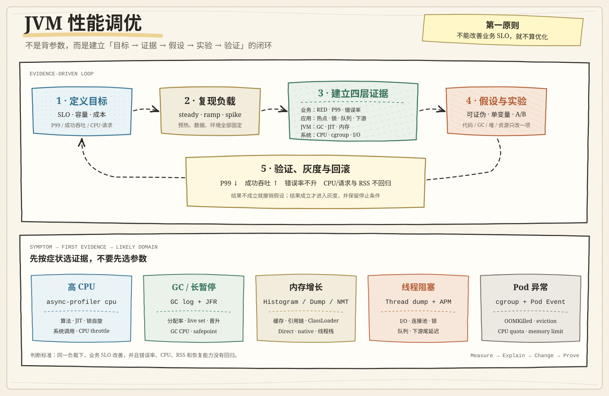

# JVM 性能调优：方法论与实战

JVM 性能调优不是寻找一套“万能启动参数”，而是围绕业务目标建立证据链：

```text
SLO → 可复现负载 → 业务/JVM/系统证据 → 可证伪假设
    → 单变量实验 → 回归验证 → 灰度与回滚
```



> [!important]
> 先解决算法、下游、锁竞争、无界排队和资源限制，再调整 GC 与堆，最后才考虑 Region、JIT 阈值等 JVM 内部参数。

## 一、先定义什么叫“性能好”

性能目标之间存在取舍，必须先确定优先级。

| 目标 | 主要指标 | 常见代价 |
|---|---|---|
| 吞吐 | QPS、任务数/秒、成功吞吐 | 批次、队列和暂停可能增大 |
| 延迟 | P50、P95、P99、P999 | 需要更多 CPU 和内存余量 |
| 资源效率 | CPU/请求、内存/实例、成本/请求 | 可能牺牲峰值性能 |
| 启动速度 | 进程就绪、首请求、预热时长 | 可能牺牲稳态优化 |
| 稳定性 | 错误率、超时率、OOM、恢复时间 | 需要限流和容量冗余 |

平均延迟不能代表尾延迟。分析时应同时观察：

- 入口到达率与成功完成率；
- P50、P95、P99，而不只是平均值；
- 错误率、超时率、拒绝率；
- 在途请求、队列长度和连接池等待；
- CPU/请求、RSS、GC CPU 与容器节流。

压测前固定应用版本、JDK build、JVM 参数、容器资源、数据规模、依赖版本和流量组成，避免比较两个不同的实验环境。

## 二、八个调优维度

### 1. 应用代码与数据结构

优先检查：

- 算法复杂度和重复计算；
- 不合理的数据结构；
- 字符串、集合和数组复制；
- 装箱、反射、正则编译；
- JSON、压缩、加密和序列化；
- 热路径中的临时对象分配。

CPU 热点来自业务算法时，调整 GC 基本无效。分配率高时，也应先用 JFR 或 allocation flame graph 定位调用栈，而不是凭感觉做对象池化。

微基准使用 JMH，并正确处理预热、Fork、死代码消除和常量折叠。端到端瓶颈不能仅靠微基准判断。

### 2. 并发、线程与排队

- CPU-bound：限制并行度，重点优化计算、共享状态与缓存局部性。
- I/O-bound：可以提高并发，但上限仍由连接池、数据库、下游配额和内存决定。
- 线程池和队列必须有界，并配置超时、拒绝、降级和背压。
- 锁内不要执行数据库、HTTP、磁盘 I/O 等不可控操作。
- 虚拟线程适合大量阻塞 I/O，不会降低单次任务的 CPU 成本，也不能替代限流。

当到达率长期大于完成率时，系统已经过载。继续增加线程往往只会扩大排队和上下文切换。

### 3. GC 与 Java Heap

| GC | 主要目标 | 典型场景 | 主要代价 |
|---|---|---|---|
| Serial | 简单、低资源 | 单核、极小堆、工具型进程 | 完全串行、暂停明显 |
| Parallel | 吞吐 | 离线计算、批处理 | 暂停通常较长 |
| G1 | 吞吐与暂停平衡 | 大多数在线服务的默认基线 | 仍存在 STW 与并发开销 |
| Generational ZGC | 严格尾延迟 | 大堆、低暂停服务 | 更多 CPU 与内存余量 |
| Shenandoah | 低暂停 | 需要并发疏散的场景 | 以并发资源换暂停 |

GC 调优应观察：

- allocation rate 与 promotion rate；
- 回收后的 old live set；
- GC CPU 占比和暂停分布；
- Full GC、degenerated GC、allocation stall；
- 并发回收能否赶上对象分配速度；
- GC 事件是否与业务 P99 同时发生。

`MaxGCPauseMillis` 是目标，不是保证。没有 GC phase 证据时，不要先调整 Region、年轻代比例或 GC 线程数。

### 4. 非堆与 Native Memory

容器内存不等于 Java Heap：

```text
进程内存 ≈ Heap + Metaspace + Code Cache + Direct Buffer
         + 平台线程栈 + GC/JIT 本地结构 + JNI/native + 其他开销
```

因此 `Xmx` 不能等于容器 memory limit。

| 区域 | 常见问题 | 主要证据 |
|---|---|---|
| Metaspace | 动态代理、热部署、ClassLoader 泄漏 | class load/unload、loader 数量、NMT |
| Code Cache | JIT 代码缓存接近满、停止编译 | `Compiler.codecache`、编译队列 |
| Direct Buffer | NIO/Netty 堆外内存增长 | BufferPoolMXBean、库指标、NMT |
| 平台线程栈 | 线程数过多或 `Xss` 过大 | 线程数、线程状态、RSS |
| JNI/native | 第三方库或分配器增长 | NMT、RSS、perf/eBPF、库指标 |

NMT 必须在 JVM 启动时开启：

```bash
-XX:NativeMemoryTracking=summary

jcmd "$PID" VM.native_memory baseline
jcmd "$PID" VM.native_memory summary.diff
```

NMT 主要跟踪 HotSpot 自身的 native 分配，并不完整覆盖所有第三方 JNI/native 内存。

### 5. JIT、类加载与启动

HotSpot 会经历解释执行、C1/C2 分层编译、OSR、投机优化和去优化。冷启动或性能周期性变化时，应检查：

- 编译队列、Code Cache 和 deoptimization；
- 类加载、反射扫描、动态代理和静态初始化；
- 首请求、首分钟和稳态性能差异；
- CDS/AOT cache 是否适合当前启动路径。

不要无证据关闭 Tiered Compilation、逃逸分析或修改编译阈值。这些参数通常是在 CPU、内存、预热速度与峰值性能之间交换成本。

### 6. 数据库、网络与 I/O

很多“JVM 性能问题”实际来自：

- 慢 SQL、N+1、缺少索引；
- 数据库或 HTTP 连接池等待；
- DNS、TLS、网络重传和跨区域 RTT；
- 磁盘队列、日志写入和文件系统；
- 下游服务尾延迟和重试风暴。

沿调用链拆分耗时：

```text
入口排队 → 应用处理 → 连接池等待 → 下游调用 → 返回与序列化
```

缓存和批处理可以提升吞吐，但会增加等待、内存和一致性复杂度。批处理需要明确最大条数、最大字节数和最大等待时间；缓存需要容量、TTL、淘汰和回源保护。

### 7. OS、硬件与容器

重点检查：

- CPU 核数、频率、NUMA 和上下文切换；
- major page fault、THP、Swap 和内存回收；
- 磁盘延迟、I/O 队列和网络 softirq；
- cgroup CPU quota、throttling 与 PSI；
- cgroup memory、OOM kill 与节点驱逐。

Kubernetes 中：

- CPU limit 通过 throttling 执行，GC、JIT 与业务线程会共同竞争 quota；
- memory limit 约束整个 cgroup，而不只是 Java Heap；
- `OOMKilled` 是内核杀进程，不一定产生 Java OOME 或 heap dump；
- JVM 容器感知异常时，默认堆和 GC/JIT 线程数可能与真实资源不匹配。

### 8. JDK 与运行环境

生产环境应选择仍受支持的 JDK，固定完整 JDK build、发行商、CPU 架构和镜像 digest。升级 JDK 可能获得 GC、JIT、虚拟线程和容器识别改进，但必须重新建立兼容性与性能基线。

## 三、诊断工具与最小证据包

### 常驻观测

- 业务 RED：Rate、Errors、Duration；
- 资源 USE：Utilization、Saturation、Errors；
- APM 与调用链；
- JVM、容器和节点指标；
- GC 与 safepoint 滚动日志。

```bash
-Xlog:gc*,safepoint:file=/var/log/app/gc-%p.log:time,uptime,level,tags:filecount=5,filesize=50M
```

### 事故窗口

综合录制：

```bash
jcmd "$PID" JFR.start name=incident settings=profile \
  duration=120s filename=/tmp/incident.jfr
```

CPU、分配和锁：

```bash
asprof -d 30 -e cpu   -f /tmp/cpu.html   "$PID"
asprof -d 30 -e alloc -f /tmp/alloc.html "$PID"
asprof -d 30 -e lock  -f /tmp/lock.html  "$PID"
```

JVM 状态：

```bash
jcmd "$PID" VM.command_line
jcmd "$PID" VM.flags
jcmd "$PID" GC.heap_info
jcmd "$PID" Compiler.codecache
jcmd "$PID" Thread.print -l
```

> [!warning]
> Heap dump 和 class histogram 可能触发较长停顿并占用大量磁盘。生产环境优先在副本、维护窗口或故障演练环境执行，并按敏感数据管理 dump 文件。

## 四、五个业务实战场景

### 场景一：订单接口 P99 周期性尖刺

**现象：**大促时平均延迟约 80ms，但每隔几秒 P99 跳高，CPU 尚未打满。

```text
用户        网关       订单服务          Redis/DB        JVM GC
 │ POST /order │            │                │              │
 ├────────────>│───────────> │                │              │
 │             │             ├─构造 DTO/Map───┤              │
 │             │             ├─JSON/String/byte[] 大量分配──>│
 │             │             │                │   Young GC  │
 │             │             │<────── STW 暂停 ──────────────┤
 │<────────────┴─────────────┤                │              │
 │         本次请求进入 P99   │                │              │
```

#### 采证

```bash
jcmd "$PID" JFR.start name=gc-incident settings=profile \
  duration=120s filename=/tmp/gc-incident.jfr

asprof -d 30 -e alloc -f /tmp/alloc.html "$PID"
```

将业务 P99、GC pause、safepoint、allocation rate、晋升率和回收后 live set 对齐到同一时间轴。

#### 判断与动作

- 回收后老年代稳定、分配率很高：减少热路径临时对象，例如避免 `DTO → Map → JSON String → byte[]` 多次复制，直接向输出流序列化。
- 回收后 live set 持续接近 Xmx：检查缓存、对象保留与真实堆容量。
- 应用层优化后暂停仍不达标：在相同堆和负载下，单独 A/B 比较 G1 与 ZGC。

```bash
# A 组
java -XX:+UseG1GC ...

# B 组
java -XX:+UseZGC ...
```

**验收：**P99 达标；GC pause 与请求尖刺不再强相关；CPU/请求、RSS 与错误率没有回归。

### 场景二：规则引擎发布后 CPU 打满

**现象：**风控服务发布规则后 CPU 从中位负载升至接近饱和，QPS 反而下降。

```text
请求       风控服务               规则集合
 │            │                       │
 ├───────────>│ 遍历全部规则 O(N)      │
 │            ├──────────────────────>│
 │            │ 每次重新编译正则       │
 │            │ 对文本重复扫描 O(N×M)  │
 │            │<──────────────────────┤
 │<───────────┤ 线程占满，后续请求排队  │
```

#### 采证

```bash
top -H -p "$PID"
printf '0x%x\n' "$TID"
jcmd "$PID" Thread.print -l > /tmp/threads.txt
asprof -d 30 -e cpu -f /tmp/cpu.html "$PID"
```

若热点集中在 `Pattern.compile`、字符串处理或全量规则遍历，根因属于应用层。

#### 处理示例

```java
// 反例：每个请求、每条规则都重新编译
if (Pattern.matches(rule.regex(), text)) {
    // ...
}

// 改进：规则加载时完成编译
record CompiledRule(Pattern pattern, Action action) {}

if (rule.pattern().matcher(text).find()) {
    // ...
}
```

进一步按业务字段建立候选规则索引，避免每次扫描全部规则。

**验收：**CPU/请求下降、成功 QPS 提升、P99 降低，并验证业务结果与优化前一致。

### 场景三：价格缓存导致慢性内存泄漏

**现象：**服务运行数天后堆持续上涨，Full GC 后也无法回落，最终 OOME。

```text
请求       价格服务        ConcurrentHashMap       GC
 │            │                    │                │
 ├───────────>│ tenant+sku 查缓存   │                │
 │            ├───────────────────>│                │
 │            │ miss 后写入新 Key   │                │
 │            ├───────────────────>│ 永不淘汰        │
 │            │                    │<── GC Roots ───│
 │            │                    │  对象始终可达    │
 │            │        after-GC heap 持续升高         │
```

#### 采证

```bash
jcmd "$PID" GC.class_histogram > /tmp/histo-1.txt
sleep 600
jcmd "$PID" GC.class_histogram > /tmp/histo-2.txt

# 高影响操作：只在副本或维护窗口执行
jcmd "$PID" GC.heap_dump /data/dumps/heap.hprof
```

在 MAT/JMC 中沿 `Dominator Tree → Retained Size → Path to GC Roots` 查找持有链。

#### 处理示例

确认是无界缓存后，可以使用有容量和过期策略的缓存。容量必须由对象大小、命中率和内存预算决定。

```java
Cache<PriceKey, Price> prices = Caffeine.newBuilder()
    .maximumSize(100_000)
    .expireAfterAccess(Duration.ofMinutes(30))
    .recordStats()
    .build();
```

若缓存值大小差异很大，应按 weight 限制，而不是仅按条目数量。

**验收：**after-GC heap 最终进入平台期；缓存大小有明确上界；命中率、淘汰率和回源流量可接受。

### 场景四：支付网关变慢拖垮线程池

**现象：**第三方支付耗时从百毫秒升至数秒，本服务 CPU 很低，但接口大量超时。

```text
请求流量       业务线程池       HTTP 连接池      支付网关
   │                │                 │               │
   ├───────────────>│                 │               │
   │                ├───────────────> │──────────────>│
   │                │   等连接/响应    │     数秒       │
   ├───────────────>│ 队列继续增长     │               │
   ├───────────────>│ 所有线程阻塞     │               │
   │                │                 │<──────────────┤
   │<── 超时/拒绝 ──┤                 │               │
```

#### 采证

连续采集三份线程转储：

```bash
for i in 1 2 3; do
  jcmd "$PID" Thread.print -l > "/tmp/threads-$i.txt"
  sleep 5
done
```

同时观察：

- 业务线程 active/max/queue；
- HTTP 或数据库连接池 active/pending；
- 下游 P95/P99 与超时率；
- 入口到达率、完成率和在途请求数。

#### 处理顺序

1. 设置符合业务预算的连接超时、请求超时和整体 deadline。
2. 按下游容量限制最大 in-flight 请求。
3. 使用有界队列，过载时明确拒绝、降级或排队。
4. 使用独立 bulkhead，避免支付网关拖垮其他接口。
5. 虚拟线程只能降低阻塞线程成本，不能增加支付网关或连接池容量。

**验收：**下游故障时队列保持有界；健康接口不受牵连；系统能在下游恢复后快速清空积压。

### 场景五：Kubernetes 中 OOMKilled 与 CPU 节流

**现象：**Pod 没有 Java OOME 日志却退出 137；另一些时段 CPU 平均利用率不高，但 P99 抖动。

```text
JVM                  cgroup                Linux Kernel
 │ Heap               │ memory.current       │
 │ Metaspace           │ 持续接近 memory.max  │
 │ Direct Buffer ─────>│                     │
 │ Thread Stack        │                     │
 │ Native Memory       │                     │
 │                     ├── 超出 limit ──────>│ OOM Kill
 │<────────────── SIGKILL，来不及写 heap dump ┤

业务线程 + GC + JIT ──> 每周期耗尽 cpu.max ──> throttling ──> P99 抖动
```

#### 采证

```bash
kubectl -n "$NS" describe pod "$POD"
kubectl -n "$NS" get pod "$POD" \
  -o jsonpath='{.status.containerStatuses[0].lastState.terminated.reason}{"\n"}'

kubectl -n "$NS" exec "$POD" -- java -XshowSettings:system -version
```

cgroup v2：

```bash
kubectl -n "$NS" exec "$POD" -- sh -c '
  echo "== memory =="
  cat /sys/fs/cgroup/memory.current
  cat /sys/fs/cgroup/memory.max
  cat /sys/fs/cgroup/memory.events
  echo "== cpu =="
  cat /sys/fs/cgroup/cpu.max
  cat /sys/fs/cgroup/cpu.stat
'
```

关注：

- `memory.events` 中 `oom_kill` 是否增长；
- `cpu.stat` 中 `nr_throttled`、`throttled_usec` 是否与 P99 同时增长；
- Java Heap 是否稳定，而 RSS/cgroup memory 仍上涨；
- JVM 识别的 CPU 数是否符合容器实际配额。

#### 内存预算示例

假设容器限制为 2048MiB，实测非堆、Direct、线程栈和 native 峰值共 520MiB，并预留 256MiB 安全余量：

```text
Xmx 上限 ≈ 2048 - 520 - 256 = 1272MiB
```

这只是计算方法，不是通用比例。只有 JVM 感知 CPU 数确实错误时，才考虑 `-XX:ActiveProcessorCount=N`。

**验收：**`oom_kill` 不再增长；内存峰值与 limit 间有明确余量；throttling 下降；相同负载下 P99 稳定。

## 五、按症状选择第一件工具

| 症状 | 第一批证据 | 下一步 |
|---|---|---|
| CPU 高 | async-profiler CPU、线程级 CPU、cgroup throttle | 算法、JIT、锁、系统调用 |
| GC 频繁 | GC log、JFR、allocation profile | 分配率、live set、堆余量 |
| 长暂停 | GC/safepoint 与业务 P99 对齐 | GC、CPU starvation、页故障 |
| Heap 上涨 | after-GC heap、histogram、heap dump | 缓存、引用链、ClassLoader |
| RSS 上涨 | NMT、Direct Buffer、线程数、cgroup | native、mmap、线程栈 |
| 线程阻塞 | 连续 thread dump、APM、连接池 | I/O、锁、排队、下游 |
| 启动慢 | 启动期 JFR、类加载、JIT | 扫描、静态初始化、CDS |
| Pod 被杀 | Pod Event、memory.events、RSS | OOMKilled、驱逐、native 内存 |

```text
                 ┌─ CPU 接近饱和 ───> CPU profiler ──> 算法/JIT/锁/系统调用
SLO 不达标 ──────┼─ CPU 不高、线程多 ─> Thread dump/APM ─> I/O/连接池/排队
                 ├─ GC 时间相关 ────> GC log + JFR ──> 分配/live set/收集器
                 ├─ Heap 持续上涨 ──> Histogram/Dump ─> 缓存/引用/ClassLoader
                 └─ RSS 或 Pod 异常 ─> NMT+cgroup ───> Direct/native/limit
```

## 六、标准调优闭环

1. 定义 SLO、容量和成本目标。
2. 建立 steady、ramp、spike、soak 四类负载基线。
3. 将业务、JVM、cgroup 和 OS 指标对齐到同一时间轴。
4. 提出可证伪假设，而不是“调个参数试试”。
5. 一次只改变代码、GC、堆、线程池或资源配置中的一个变量。
6. 重复多轮 A/B，比较 P99、成功吞吐、错误率、CPU/请求和 RSS。
7. 灰度发布，明确停止条件和回滚条件。

### 常见误区

- 因为 GC 频繁就直接增大 `Xmx`；
- 将 `Xmx` 设置为容器 memory limit；
- 只看平均延迟，不看 P99 和错误率；
- 同时修改 GC、堆、线程池和容器资源；
- 用虚拟线程解决 CPU-bound 问题；
- 增大线程池掩盖慢下游或连接池耗尽；
- 使用无界队列、无界缓存；
- 用 `System.gc()` 作为正常回收策略；
- 用单次压测或没有预热的微基准下结论。

## 七、参考资料

- [Oracle GC Tuning Guide](https://docs.oracle.com/en/java/javase/21/gctuning/)
- [OpenJDK JEP 158: Unified JVM Logging](https://openjdk.org/jeps/158)
- [OpenJDK JEP 328: Flight Recorder](https://openjdk.org/jeps/328)
- [OpenJDK JEP 444: Virtual Threads](https://openjdk.org/jeps/444)
- [OpenJDK JMH](https://github.com/openjdk/jmh)
- [Oracle jcmd](https://docs.oracle.com/en/java/javase/21/docs/specs/man/jcmd.html)
- [Oracle Native Memory Tracking](https://docs.oracle.com/en/java/javase/21/vm/native-memory-tracking.html)
- [async-profiler](https://github.com/async-profiler/async-profiler)
- [Kubernetes Resource Management](https://kubernetes.io/docs/concepts/configuration/manage-resources-containers/)
- [Linux cgroup v2](https://www.kernel.org/doc/html/latest/admin-guide/cgroup-v2.html)
- [Google SRE: SLO](https://sre.google/workbook/slo-document/)
- [Brendan Gregg: USE Method](https://www.brendangregg.com/usemethod.html)

